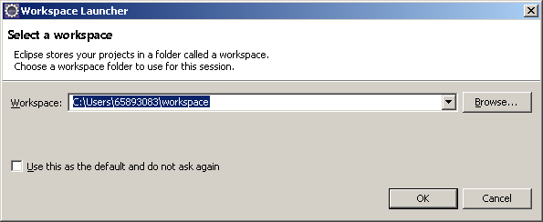
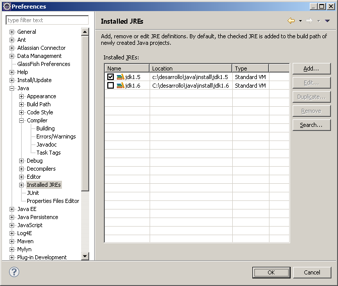
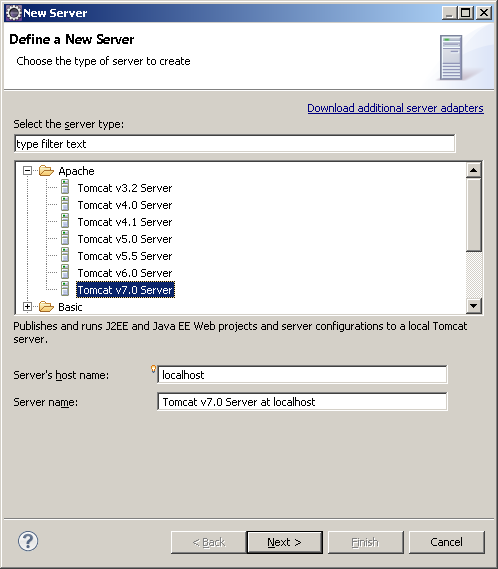
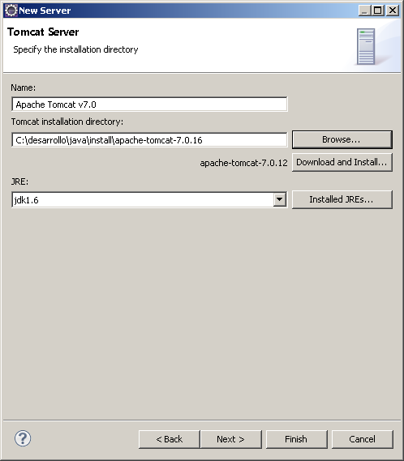
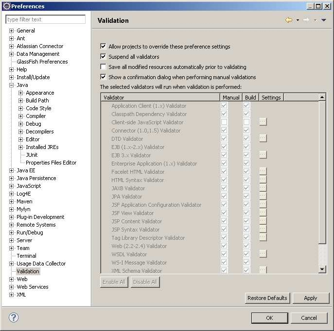
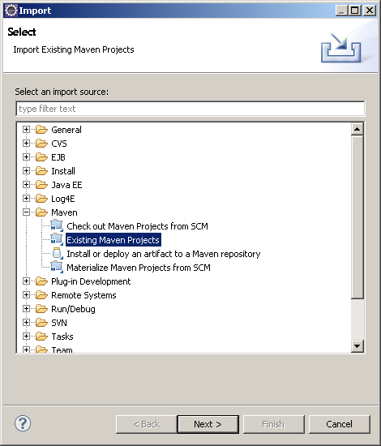

> *Este documento se ha migrado desde el original:
[Documentación/5 Manuales y documentación técnica/Documentación técnica/Guías y ayudas/SGM_2012_10_Configuración del entorno de desarrollo.pdf](pdfs/SGM_2012_10_Configuracion_del_entorno_de_desarrollo.pdf) en [https://github.com/e-admin/alsigm/releases/download/Documentacion/Documentacion_ALSIGM_3.0.rar](https://github.com/e-admin/alsigm/releases/download/Documentacion/Documentacion_ALSIGM_3.0.rar)*


## Introducción


### Visión general del sistema

AL SIGM es la plataforma de Tramitación Electrónica del MINETUR, solución integral
para la tramitación electrónica de los procedimientos administrativos, que fomenta la
interoperabilidad entre administraciones mediante su adaptación a estándares de
comunicación así como la reutilización de recursos e información pública.

### Finalidad del documento

El objeto del presente documento es el de detallar los requisitos de configuración para
establecer un entorno de desarrollo para AL SIGM. Los requisitos de configuración
expuestos en este documento se establecen en base al IDE Eclipse.

### Definiciones y Abreviaturas

A continuación se expone una tabla con los diferentes acrónimos y abreviaturas
utilizados a lo largo del documento, con su correspondiente definición.


|Acrónimo / Abreviatura | Definición |
|:----:|:----|
|MINETUR|Ministerio de Industria, Energía y Turismo|
|IECISA|Informática El Corte Inglés S.A.|
|SIGM|Sistema Integrado de Gestión de Expedientes Modular|
|AL|Administración Local|


## Requisitos del entorno de desarrollo

### Requisitos Hardware

|:----|:----|
|Memoria|2 GB|
|Espacio libre en disco|mínimo 5GB|


### Requisitos Software

|:----|:----|
|Sistema operativo|Windows XP, OpenSUSE 11, Windows 7|
|Servidor de aplicaciones|Apache Tomcat 7.0.16|
|Servidor de base de datos|PostgreSQL 9.0.3|
|Cliente de base de datos|pgAdmin III 1.12|
|Gestor de documentos| LibreOffice 3.3 o superior, escuchando en el puerto 8100|
|IDE|Eclipse 3.6 Helios o superior|
|Máquina virtual Java|JDK 1.5 para compilar, 1.6 para Apache Tomcat|


### Requisitos de instalación

* **Base de datos**: Se deben crear los esquemas de base de datos correspondientes
siguiendo las indicaciones del documento [Manual de Instalación de AL SIGM](../instalación/Manual-de-instalación-AL-SIGM.html)
* **Servidor de aplicaciones**: el servidor de aplicaciones Apache Tomcat se debe configurar siguiendo las indicaciones del documento [Manual de Instalación de AL SIGM](../instalación/Manual-de-instalación-AL-SIGM.html)

* **Gestor de documentos (LibreOffice)**: se debe configurar siguiendo las indicaciones del documento [Configuracion_LibreOffice_3.3](../instalación/Configuración-LibreOffice-3.3.html)


## Configuración del IDE

### Máquina virtual Java (JVM)

Se requiere la versión 1.5 o superior de JDK para la ejecución del IDE Eclipse 3.4 Helios.

### Directorio del espacio de trabajo (workspace)

Después de haber instalado, el IDE Eclipse, se debe ejecutar una primera e introducir
el directorio del espacio de trabajo (workspace) para los proyectos de AL SIGM.



### Definición de JDK

Es necesario tener definida una JDK 1.5 que se utilizará para la compilación y otra JDK
1.6 que se utilizará para arrancar el Apache Tomcat. Para ello iremos a la opción:

*Menú Window -> Opción Preferences -> Java -> Installed JREs*



Marcaremos por defecto la JDK 1.5 para compilar los proyectos.


### Configuración del servidor de aplicaciones en el IDE

Para la depuración de las aplicaciones dentro del IDE, tenemos que configurar el
servidor de aplicaciones que va a ser utilizado. En este caso, utilizaremos el servidor
de aplicaciones Apache Tomcat 7.0.16, que se ha debido instalar previamente:

*Menú Window -> Opción Show view -> Opción Servers*

En la vista Servers que se ha abierto, abrimos el menú contextual y pulsamos la opción
New, y a continuación la opción Server.

En el cuadro de diálogo que se abre, elegimos como tipo de servidor Tomcat 7.0
server.



Una vez hecho, pulsamos el botón Next, dejando sin cambiar el resto de opciones.

En el siguiente cuadro de diálogo, se debe introducir el directorio de instalación del
servidor Tomcat (Tomcat installation directory)



A continuación en el mismo cuadro de diálogo, se debe indicar la versión de JRE que va
a utilizarse para la ejecución del Apache Tomcat, en éste caso la JDK 1.6.


### Preferencias de compilación

Es necesario establecer las siguientes preferencias de compilación:

* Desactivar las validaciones de páginas JSP y XML:
*Menú Window -> Opción Preferences -> Propiedad Validation*, marcar la casilla `Suspend all validators`



## Importación de proyectos

Los proyectos de AL SIGM se pueden construir mediante maven, lo cual puede facilitar
la importación de estos proyectos en eclipse así como la resolución de las
dependencias de librerías jars. Para ello se proporciona el repositorio de artefactos
necesario en la sección fuentes que contiene todas las librerías jars y recursos
necesarios.

### Prerrequisitos

* Tener una Jdk 1.5 instalada
* Tener instalado maven 2.2.1
* Archivo `settings.xml` de maven personalizado (opcional)
* Repositorio de maven con que contenga el repository proporcionado

### Instalación Jdk

Se deberá tener instalado la Jdk 1.5 si se quiere generar los proyectos. Se recomienda
tener instalados los Jdk en alguna ruta que no contenga espacios en el path, por
ejemplo `c:\desarrollo\java\jdk1.5`.

### Instalación de maven

Se deberá tener instalado maven 2.2.1 en el equipo. Al igual que con la Jdk, es
recomendable tenerlo bajo una ruta que no contenga espacios, por ejemplo
`c:\desarrollo\java\maven`

Información referente a instalación de maven [http://maven.apache.org/download.html#Installation](http://maven.apache.org/download.html#Installation)


### Personalización de settings.xml

En caso de que se quiera generar, regenerar los proyectos proporcionados con los
fuentes con maven, se ha obligado a que cuando se realice la tarea de compilación se
use de manera obligatoria con una Jdk 1.5. Para ello se deberán definir unas variables
en el `settings.xml` de maven que se encuentra bajo el *"home del usuario actual"*`/.m2/settings.xml`

``` xml
<settings>
  <profiles>
    <profile>
      <id>development</id>
      <properties>
        <JAVA_1_5_HOME>c:/desarrollo/java/jdk1.5/</JAVA_1_5_HOME>
      </properties>
    </profile>
  </profiles>
  <activeProfiles>
    <activeProfile>development</activeProfile>
  </activeProfiles>
</settings>
```

**Nota**: esto solo es necesario si se quiere regenerar con maven, en caso de quererlo
hacer con otro Ide no será necesario.


### Importación para eclipse

Mediante la ejecución de `mvn eclipse:clean eclipse:eclipse` en el proyecto deseado se
podrá generar automáticamente el archivo `.project` y `.classpath` necesario para la
importación del proyecto en eclipse. En eclipse adicionalmente se deberá definir la
variable de classpath `M2_REPO` que deberá apuntar al repositorio local. En maven el
repositorio local por defecto  se encuentra bajo  la ruta *"home del usuario actual"*`/.m2/repository`

Para maven todas las librerías son artefactos que se almacenan en dicha ruta, por lo
tanto deberemos copiar el contenido de la carpeta  `repository` que se encuentra en los
fuentes de la distribución en esta carpeta repository de maven.

Después de haber generado el `.classpath` y `.project` correspondiente, se debe proceder
a su importación en el workspace definido al iniciar Eclipse.

* Abrir el menú File y seleccionar la opción Import.
* En el cuadro de diálogo, que se abre, seleccionar en la carpeta *General*, la opción *Existing projects into Workspace* 

* Después de pulsar el botón *Next*, en el nuevo cuadro de diálogo, indicamos en
*Select root directory*, el directorio en el hemos descomprimido los fuentes de AL
SIGM, y marcamos la casilla *Copy projects into workspace*. Pulsamos el botón
Finish.


### Orden y secuencia de comandos de regeneración de todos los artefactos de AL SIGM a partir de los fuentes

Si a partir de los fuentes proporcionados se desea regenerar todo AL SIGM hay que
situarse desde línea de comandos en el directorio principal (proyecto raíz donde se
encuentra el archivo `pom.xml` lanzador) y ejecutar los comandos maven en el siguiente
orden:

``` bash
mvn clean install -Dmaven.test.skip=true
mvn clean install -Dwars -Dmaven.test.skip=true
mvn package -P generate-distri
```

Después de ejecutar éstos 3 comandos se habrá creado un directorio `SIGEM_DIST` en
el que encontraremos todos los war generados, la configuración externalizada para en
entorno por defecto y los scripts de base de datos. Si se desea generar configuración
externalizada para una plataforma específica se puede consultar el documento 
[Manual de Uso Herramienta Configuraciones básicas](Manual-de-Uso-Herramienta-Configuraciones-Básicas.html)


### Comandos más frecuentes maven

* **`mvn clean package -Dmaven.test.skip=true`** : genera artefacto pero no lo copia al repositorio local
* **`mvn clean install -Dmaven.test.skip=true`** : además de generar el artefacto lo copia en el repositorio local para que se use por el resto de proyectos, en caso de no estar en el repositorio local el resto de proyectos que lo usen no se actualizarán a este nuevo artefacto generado.
* **`mvn eclipse:clean eclipse:eclipse`** : genera automáticamente el archivo `.project` y `.classpath` necesarios para la importación del proyecto en eclipse.

La opción `-o` hace trabajar a maven en modo offline haciendo la búsqueda de los artefactos únicamente en el repositorio local.

Los comandos anteriores son también válidos si los lanzamos desde el raíz de los
fuentes y lo que hará por defecto es ejecutar el comando a todos los artefactos que no
son war.

Si queremos que desde el raíz se ejecuten los comandos en los war se deberá ejecutar
el comando respectivo con la opción `-Dwars`

Ejemplos desde el raíz:

**`mvn clean install -Dmaven.test.skip=true`** (instalará todos los jars)

**`mvn clean package -Dmaven.test.skip=true -Dwars`** (genera los wars)

