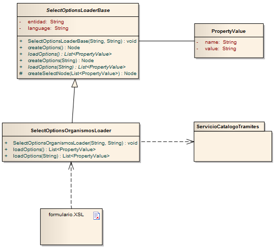
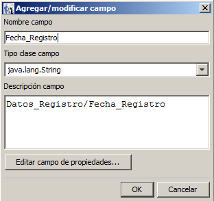

> *Este documento se ha migrado desde el original: 
[Documentación/5 Manuales y documentación técnica/Documentación técnica/Guías y ayudas/SGM_2012_10_Manual diseño Registro Telemático.pdf](pdfs/SGM_2012_10_Manual_diseño_Registro_Telemático.pdf) en [https://github.com/e-admin/alsigm/releases/download/Documentacion/Documentacion_ALSIGM_3.0.rar](https://github.com/e-admin/alsigm/releases/download/Documentacion/Documentacion_ALSIGM_3.0.rar)*


## Introducción


### Visión general del sistema

AL SIGM es la plataforma de Tramitación Electrónica del MINETUR, solución integral
para la tramitación electrónica de los procedimientos administrativos, que fomenta la
interoperabilidad entre administraciones mediante su adaptación a estándares de
comunicación así como la reutilización de recursos e información pública.

### Finalidad del documento

El objeto de este documento es describir el diseño y configuración de un Registro
Telemático, así como de todos los componentes necesarios para su correcto
funcionamiento.

*Nota importante*: el Registro Telemático de SIGM utiliza para firmar, la plataforma de
firma del MINHAP @FIRMA. Si no se dispone de acceso a esta plataforma, pero el
organismo cuenta con otro sistema de firma electrónica, SIGM dispone de un conector
para la integración.


### Definiciones y Abreviaturas

A continuación se expone una tabla con los diferentes acrónimos y abreviaturas
utilizados a lo largo del documento, con su correspondiente definición.


|Acrónimo / Abreviatura | Definición |
|:----:|:----|
|MINETUR|Ministerio de Industria, Energía y Turismo|
|IECISA|Informática El Corte Inglés S.A.|
|SIGM|Sistema Integrado de Gestión de Expedientes Modular|
|AL|Administración Local|


### Documentos relacionados

* SGM_2012_**_Manual de Usuario Tramitación Telemática
* SGM_2012_**_ Configuración Registro Telemático
* SGM_2012_**_Configuración de la Consolidación de Registro Telemático Plataforma Validacion @Firma


## Estructura de la aplicación

La aplicación del Registro Telemático de SIGM, es configurable en cuanto a su diseño:
formularios, idioma, justificantes, etc. y funcionalidad: trámite que origina, o que
continúa, documentos que permite anexar, firma, etc.

A continuación, se describen los dos principales temas relacionados con la
configuración y que son determinantes en el diseño y desarrollo de un Registro
Telemático en SIGM:

1. La configuración del trámite en la base de datos.
2. Los ficheros de recursos del trámite (formularios, justificantes), en el
directorio de configuración externalizada, o en su defecto, dentro de la
aplicación de Registro Telemático.

La configuración del trámite en la base de datos, depende de las siguientes tablas:

* `sgmrtcatalogo_tramites`: contiene información básica relacionada con el trámite.
* `sgmrtcatalogo_organos`: contiene información relacionada con los órganos que pueden ser destinatarios de un trámite.
* `sgmrtcatalogo_documentos`: contiene la definición de los diferentes tipos de documentos que se pueden asociar a un trámite.
* `sgmrtcatalogo_docstramite: contiene la asociación de un tipo de documento (definido en la tabla `sgmrtcatalogo_documentos`) con un trámite en concreto (definido en la tabla `sgmrtcatalogo_tramites`).
* `sgmafconector_autenticacion: contiene la asociación de un conector de autenticación como certificado digital o login web nivel 2 (definido en la tabla `sgmrtcatalogo_conectores`) con un trámite (definido en la tabla `sgmrtcatalogo_tramites`).

Los registros de las tablas anteriores, pueden ser editados/modificados por medio de la aplicación de gestión del *Catálogo de Trámites del Registro Telemático*.

La configuración de un trámite, en el directorio de configuración externalizada, o en su
defecto, dentro de la *aplicación Web de Registro Telemático*, se determina por medio
de los siguientes ficheros:


* `tramites/[ID_TRAMITE]/formulario_vacio.xsl`: definición del formulario que se mostrará al ciudadano, en este caso, vacío para que lo rellene.
* `tramites/[ID_TRAMITE]/formulario_relleno.xsl`: definición del conjunto de datos a mostrar al ciudadano, una vez rellenado el formulario pero antes de que sea firmado y presentado.
* `Tramites/[ID_TRAMITE]/información_registro.xsl`: definición del conjunto de datos a mostrar al ciudadano, una vez registrada con éxito la solicitud del trámite presentado.
* `Tramites/[ID_TRAMITE]/plantilla.jasper`: definición de la plantilla de JasperReports que se utiliza para generar el documento PDF de justificante de presentación del registro telemático.

Los textos de los XSL anteriores se encuentran en español, pero debido a que la
aplicación es **multidioma**, existe un fichero XSL más por cada idioma, en el cual se 
redefinen los textos a mostrar para el correspondiente idioma. Igualmente, para la
generación del justificante de presentación en los diferentes idiomas, existe la
correspondiente plantilla de JasperReports para cada uno de ellos, respectivamente.

## Configuración XSL

### Formulario a rellenar por el ciudadano

Este formulario, denominado `formulario_vacio.xsl`, contiene tres partes diferenciadas:

1. Definición de textos
2. Código en JavaScript
3. Diseño del formulario

A continuación se detallan cada una de las partes anteriores:

#### Definición de textos
Se deben definir cada uno de los textos que se muestran dentro del formulario, como
una variable de la siguiente forma:

``` xml
<xsl:variable name="lang.nombre" select="'Nombre'"/>
```

Se definirán tantas variables, como textos existan. De esta forma, se podrá adaptar la
aplicación al multilenguaje mediante la creación de otro fichero XSL con la redefinición
de los textos definidos en el XSL del formulario principal (sólo la redefinición de textos,
ya que el diseño y el código JavaScript no son necesarios, serán siempre los del
formulario principal). De esta forma, el fichero para el catalán, denominado
`formulario_vacio_ca.xsl`, quedaría de la siguiente forma:

``` xml
<?xml version="1.0" encoding="ISO-8859-1"?>

<xsl:stylesheet version="1.0" xmlns:xsl="http://www.w3.org/1999/XSL/Transform">
  <xsl:import href="formulario_vacio.xsl" />
  <xsl:output encoding="ISO-8859-1" method="html"/>
  <xsl:variable name="lang.nombre" select="'CAT-Nombre'"/>
</xsl:stylesheet>
```

#### Código en Javascript
Existen una serie de arrays para realizar validaciones dentro del JSP que contiene el
formulario:

* Array `validar`: este array contiene todos los campos obligatorios.
``` javascript
var validar = new Array(1);
validar[0] = new Array('nombreSolicitante','<xsl:value-of select="$lang.nombre"/>');
```
	Por cada elemento a comprobar, dentro del formulario, se debe definir un array con dos datos:
	- El primero, es el `ID (name)` del campo dentro del formulario.
	- El segundo, es el texto correspondiente asociado a ese campo para mostrar el error por pantalla.

* Array `específicos`: este array contiene todos los campos que van a ser incluidos dentro de la etiqueta `<datos_especificos>` del xml que contiene los datos del trámite.
``` javascript
var especificos = new Array(1);
especificos[0] = new Array('domicilioNotificacion','Domicilio_Notificacion');
```

	Por cada elemento que se vaya a incluir dentro de los datos específicos, se debe definir un array con dos datos:
	- El primero, es el `ID (name)` del campo dentro del formulario.
	- El segundo, es el nombre de la etiqueta dentro del XML que contiene los datos del trámite.

* Array `validarNumero`: este array contiene todos los campos que van a contener algún tipo de validación numérica: códigos postales, cuentas bancarias, etc.
``` javascript
var validarNumero = new Array(1);
validarNumero[0] = new Array('codigoPostal','<xsl:value-of select="$lang.cp"/>',5);
```

	Por cada elemento que se vaya a incluir dentro de los datos específicos, se debe definir un array con tres datos:
	- El primero, es el `ID (name)` del campo dentro del formulario.
	- El segundo, es el texto correspondiente asociado a ese campo para mostrar el error por pantalla.
	- El tercero, es la cantidad de dígitos que debe tener.


#### Diseño del formulario
Para crear formularios con la estética SIGM, se debe tener en cuenta los siguientes aspectos:

* Agrupación de campos dentro de un bloque

``` xml
<div class="submenu">
 <h1>[TITULO DEL BLOQUE DE DATOS]</h1>
</div>
<div class="cuadro">
[DEFINICIÓN DE LOS CAMPOS CONTENIDOS DENTRO DEL BLOQUE]
</div>
```

* Definición de campos `INPUT`

``` xml
<div class="col" style="height: 35px;">
  <label class="gr">
    <xsl:attribute name="style">position: relative; width:150px;</xsl:attribute>
    <xsl:value-of select="$lang.domicilio"/>:*
  </label>
  <input type="text">
    <xsl:attribute name="style">position: relative; width:350px; </xsl:attribute>
    <xsl:attribute name="name">domicilioNotificacion</xsl:attribute>
    <xsl:attribute name="id">domicilioNotificacion</xsl:attribute>
    <xsl:attribute name="value"></xsl:attribute>
  </input>
</div>
```

* Definición de campos `SELECT`

``` xml
<div class="cuadro" style="">
  <div class="col">
    <label class="gr">
      <xsl:attribute name="style">position: relative; width:150px;</xsl:attribute>
      <xsl:value-of select="$lang.organoAlternativo"/>:
    </label>
    <select class="gr">
      <xsl:attribute name="style">position: relative; width:350px; </xsl:attribute>
      <xsl:attribute name="name">organoDestinatario</xsl:attribute>
      <xsl:attribute name="id">organoDestinatario</xsl:attribute>
      <option selected="selected" value=""></option>
      <option value="002"><xsl:value-of select="$lang.servTramLicencias"/></option>
      <option value="003"><xsl:value-of select="$lang.servSecretaria"/></option>
    </select>
  </div>
</div>
```

* Definición de campos `TEXTAREA`

``` xml
<div class="cuadro" style="">
  <div class="col">
    <label class="gr">
      <xsl:attribute name="style">position: relative; width:150px;</xsl:attribute>
      <xsl:value-of select="$lang.motivo"/>:*
    </label>
    <textarea class="gr">
      <xsl:attribute name="style">position: relative; width:490px; font:normal 100%/normal 'Arial', Tahoma, Helvetica, sans-serif;</xsl:attribute>
      <xsl:attribute name="name">motivoQueja</xsl:attribute>
      <xsl:attribute name="id">motivoQueja</xsl:attribute>
      <xsl:attribute name="rows">5</xsl:attribute>
      <xsl:attribute name="value"></xsl:attribute>
    </textarea>
  </div>
</div>
```

* Definición de campos `CHECKBOX`

``` xml
<div class="cuadro">
  <input class="gr" type="checkbox" id="solicitarEnvio" style="border:0px; width:20px;" />
  <label for="solicitarEnvio"><xsl:value-of select="$lang.solicitoEnvio"/></label>
</div>
```

En caso de necesitar cargar datos desde el XML de entrada en algún campo
del formulario se debe poner dentro del campo value del control:

``` xml
<xsl:value-of select="[RUTA DEL DATO DENTRO DEL XML]"/>
```

#### Formulario con información de solicitante segregada

En el caso de que la autenticación se realice con un certificado electrónico, si la
información del solicitante, retornada por el servicio de Validación de Certificados, se
recibe de forma segregada en nombre, primer apellido y segundo apellido, se puede
utilizar el siguiente diseño para mostrarla:

``` xml
<div class="col">
  <label class="gr">
    <xsl:attribute name="style">position: relative; width:150px;</xsl:attribute>
    <xsl:value-of select="$lang.apellido1"/>:*
  </label>
  <input type="text">
    <xsl:attribute name="style">position: relative; width:350px; </xsl:attribute>
    <xsl:attribute name="name">apellido1Solicitante</xsl:attribute>
    <xsl:attribute name="id">apellido1Solicitante</xsl:attribute>
    <xsl:attribute name="value">
      <xsl:value-of select="Datos_Registro/Remitente/Nombre_Apellidos/Primer_Apellido"/>
    </xsl:attribute>
    <xsl:attribute name="disabled"></xsl:attribute>
  </input>
</div>

<div class="col">
  <label class="gr">
    <xsl:attribute name="style">position: relative; width:150px;</xsl:attribute>
    <xsl:value-of select="$lang.apellido2"/>:*
  </label>
  <input type="text">
    <xsl:attribute name="style">position: relative; width:350px; </xsl:attribute>
    <xsl:attribute name="name">apellido2Solicitante</xsl:attribute>
    <xsl:attribute name="id">apellido2Solicitante</xsl:attribute>
    <xsl:attribute name="value">
      <xsl:value-of select="Datos_Registro/Remitente/Nombre_Apellidos/Segundo_Apellido"/>
    </xsl:attribute>
    <xsl:attribute name="disabled"></xsl:attribute>
  </input>
</div>
<div class="col">
  <label class="gr">
    <xsl:attribute name="style">position: relative; width:150px;</xsl:attribute>
    <xsl:value-of select="$lang.nombre"/>:*
  </label>
  <input type="text">
    <xsl:attribute name="style">position: relative; width:350px; </xsl:attribute>
    <xsl:attribute name="name">nombreSolicitante</xsl:attribute>
    <xsl:attribute name="id">nombreSolicitante</xsl:attribute>
    <xsl:attribute name="value">
      <xsl:value-of select="Datos_Registro/Remitente/Nombre_Apellidos/Nombre"/>
    </xsl:attribute>
    <xsl:attribute name="disabled"></xsl:attribute>
  </input>
</div>
```

En el XML de datos de la solicitud de registro, en su nueva versión 1.2, para el Tag de
`<Remitente>` se incluye un nuevo Tag de `<Nombre_Apellidos>`, que a su vez
incluye los Tags de `<Nombre>`, `<Primer_Apellido>` y `<Segundo_Apellido>`, para
establecer la información del solicitante cuando se ha podido segregar, y que al
combinarse con el diseño XSL se muestren en el formulario HTML.

Si la autenticación se realiza con un certificado de persona jurídica, mediante el cual se
permite que una persona física actúe como representante legal de una empresa,
organismo..., en el Tag de `<Remitente>` se establece la información de la empresa,
organismo... para a continuación incluir entonces el Tag de `<Representante_Legal>`
con la misma información indicada anteriormente, en la que el remitente es sólo
persona física.


#### Formulario con dirección del solicitante obtenida de un sistema externo de terceros

En el caso de que en la aplicación de Registro Telemático se haya configurado un
conector con un sistema externo de terceros que permita obtener las direcciones
asociadas al solicitante autenticado, se puede utilizar el siguiente diseño para permitir
al solicitante seleccionar una de sus direcciones:

* Código JavaScript:

``` xml
var direcciones = new Array(<xsl:value-of select="count(Direccion)"/>);
<xsl:for-each select="Datos_Registro/Datos_Tercero/Direcciones/Direccion">
  var id = '<xsl:value-of select="ID_Direccion" />';
  direcciones[id]=new Array();
  direcciones[id]['localidad'] = '<xsl:value-of select="Localidad" />';
  direcciones[id]['provincia'] = '<xsl:value-of select="Provincia" />';
  direcciones[id]['codigoPostal'] = '<xsl:value-of select="Codigo_Postal" />';
</xsl:for-each>

function actualizarDatosTercero(domicilio){
  var optionSelected = domicilio.options[domicilio.options.selectedIndex];
  var idDireccion = optionSelected.getAttribute('class');

  document.getElementById('codigoPostal').value=direcciones[idDireccion]['codigoPostal'];
  document.getElementById('provincia').value=direcciones[idDireccion]['provincia'];
  document.getElementById('localidad').value=direcciones[idDireccion]['localidad'];
  document.getElementById('codigoPostal').disabled='disabled';
  document.getElementById('provincia').disabled='disabled';
  document.getElementById('localidad').disabled='disabled';
}

function cambiarDireccionToEdit(){
  var inputText = document.getElementById('domicilioNotificacionHide');
  var inputSelect = document.getElementById('domicilioNotificacion');
  var buttonSeleccionar = document.getElementById('seleccionarDireccionButton');
  var buttonCambiar = document.getElementById('cambiarDireccionButton');

  buttonCambiar.style.display='none';
  buttonSeleccionar.style.display='inline';
  inputSelect.style.display='none';
  inputText.style.display='inline';
  inputSelect.id='domicilioNotificacionHide';
  inputText.id='domicilioNotificacion';

  document.getElementById('codigoPostal').value='';
  document.getElementById('provincia').value='';
  document.getElementById('localidad').value='';
  document.getElementById('codigoPostal').removeAttribute('disabled');
  document.getElementById('provincia').removeAttribute('disabled');
  document.getElementById('localidad').removeAttribute('disabled');
}

function cambiarDireccionToSelect (){
  var inputText = document.getElementById('domicilioNotificacion');
  var inputSelect = document.getElementById('domicilioNotificacionHide');
  var buttonSeleccionar = document.getElementById('seleccionarDireccionButton');
  var buttonCambiar = document.getElementById('cambiarDireccionButton');

  buttonCambiar.style.display='inline';
  buttonSeleccionar.style.display='none';

  inputSelect.style.display='inline';
  inputText.style.display='none';
  inputSelect.id='domicilioNotificacion';
  inputText.id='domicilioNotificacionHide';
  actualizarDatosTercero(inputSelect);
}
```

En el XML de datos de la solicitud de registro que se genera para combinarse con el
`formulario_vacio.xsl`, en el Tag de `<Datos_Registro>` se incluye un nuevo Tag de
`<Datos_Tercero>`, que a su vez incluye el Tag de `<Direcciones>` con la información
de cada `<Direccion>` retornada por el sistema externo de terceros.

* Diseño del formulario:

``` xml
<div class="col" style="height: 35px;">
  <label class="gr">
    <xsl:attribute name="style">position: relative; width:150px;</xsl:attribute>
    <xsl:value-of select="$lang.domicilio"/>:
  </label>

  <!-- Si hay direcciones en terceros, las mostramos -->
  <xsl:if test="count(//Direccion) &gt; 0">
    <select class="gr">
      <xsl:attribute name="style">position: relative; width:350px; display:inline;</xsl:attribute>
      <xsl:attribute name="name">domicilioNotificacion</xsl:attribute>
      <xsl:attribute name="id">domicilioNotificacion</xsl:attribute>
      <xsl:attribute name="onchange"> javascript:actualizarDatosTercero(this);</xsl:attribute>
      <xsl:for-each select="Datos_Registro/Datos_Tercero/Direcciones/Direccion">
        <option>
          <xsl:attribute name="value"><xsl:value-of select="Direccion_Completa"/></xsl:attribute>
          <xsl:attribute name="selected"><xsl:value-of select="Por_Defecto"/></xsl:attribute>
          <xsl:attribute name="class"><xsl:value-of select="ID_Direccion"/></xsl:attribute>
          <xsl:value-of select="Direccion_Completa"/>
        </option>
      </xsl:for-each>
    </select>
    <input type="text">
      <xsl:attribute name="style">position:relative; width:350px;display:none;</xsl:attribute>
      <xsl:attribute name="name">domicilioNotificacionHide</xsl:attribute>
      <xsl:attribute name="id">domicilioNotificacionHide</xsl:attribute>
      <xsl:attribute name="value">
        <xsl:value-of select="Datos_Registro/datos_especificos/Domicilio_Notificaciono"/>
      </xsl:attribute>
    </input>
    
    
  </xsl:if>

  <xsl:if test="count(//Direccion) = 0">
    <!-- Si no, caja de texto abierta -->
    <input type="text">
      <xsl:attribute name="style">position: relative; width:350px; </xsl:attribute>
      <xsl:attribute name="name">domicilioNotificacion</xsl:attribute>
      <xsl:attribute name="id">domicilioNotificacion</xsl:attribute>
      <xsl:attribute name="value">
        <xsl:value-of select="Datos_Registro/datos_especificos/Domicilio_Notificaciono"/>
      </xsl:attribute>
    </input>
  </xsl:if>
</div>

...

<div class="col">
  <label class="gr">
    <xsl:attribute name="style">position: relative; width:150px;</xsl:attribute>
    <xsl:value-of select="$lang.localidad"/>:*
  </label>
  <input type="text">
    <xsl:attribute name="style">position: relative; width:350px; </xsl:attribute>
    <xsl:attribute name="name">localidad</xsl:attribute>
    <xsl:attribute name="id">localidad</xsl:attribute>
    <xsl:attribute name="value">
      <xsl:value-of select="Datos_Registro/Datos_Tercero/Direcciones/Direccion[Por_Defecto='true']/Localidad"/>
    </xsl:attribute>
    <xsl:if test="count(//Direccion) &gt; 0">
      <xsl:attribute name="disabled"></xsl:attribute>
    </xsl:if>
  </input>
</div>
<div class="col">
  <label class="gr">
    <xsl:attribute name="style">position: relative; width:150px;</xsl:attribute>
    <xsl:value-of select="$lang.provincia"/>:*
  </label>
  <input type="text">
    <xsl:attribute name="style">position: relative; width:350px; </xsl:attribute>
    <xsl:attribute name="name">provincia</xsl:attribute>
    <xsl:attribute name="id">provincia</xsl:attribute>
    <xsl:attribute name="value">
      <xsl:value-of select="Datos_Registro/Datos_Tercero/Direcciones/Direccion[Por_Defecto='true']/Provincia"/>
    </xsl:attribute>
    <xsl:if test="count(//Direccion) &gt; 0">
      <xsl:attribute name="disabled"></xsl:attribute>
    </xsl:if>
  </input>
</div>
<div class="col">
  <label class="gr">
    <xsl:attribute name="style">position: relative; width:150px;</xsl:attribute>
    <xsl:value-of select="$lang.cp"/>:*
  </label>
  <input type="text">
    <xsl:attribute name="style">position: relative; width:350px; </xsl:attribute>
    <xsl:attribute name="name">codigoPostal</xsl:attribute>
    <xsl:attribute name="id">codigoPostal</xsl:attribute>
    <xsl:attribute name="value">
      <xsl:value-of select="Datos_Registro/Datos_Tercero/Direcciones/Direccion[Por_Defecto='true']/Codigo_Postal"/>
    </xsl:attribute>
    <xsl:if test="count(//Direccion) &gt; 0">
      <xsl:attribute name="disabled"></xsl:attribute>
    </xsl:if>
  </input>
</div>
```

Con este diseño, si para el solicitante existen direcciones de tercero asociadas en el
sistema externo de terceros, se generará un `SELECT` en el que cada opción
representará cada una de las direcciones, y los controles para introducir los datos de la
dirección se presentan inicialmente deshabilitados. Aún así, mediante las funciones
JavaScript anteriores, dichos controles se podrían habilitar para introducir una
dirección alternativa.

#### Formulario con diseños XSL reutilizables

En los formularios, siguiendo las especificaciones del lenguaje XSL, se pueden reutilizar
diseños dentro de otros diseños de forma que se pueda reutilizar el mismo código XSL
del diseño en las diferentes plantillas de los formularios que requieren el mismo
diseño.

A modo de ejemplo, el mismo diseño XSL de un control de selección de tipo `SELECT`
podría existir en varios de los formularios actuales ya diseñados:

A partir de la estructura de directorios que se ha definido para establecer los
recursos de los diferentes trámites telemáticos en las diferentes entidades, bien en
la configuración externalizada, o bien, en la propia aplicación:

```
[Carpeta de configuración "tramites"]
   [Carpeta de Código de Entidad]
      [Carpeta de Código de Trámite]
         formulario_vacio.xsl
         formulario_vacio_[Idioma].xsl
         ...
```

el diseño común que, para el ejemplo planteado, incluye el HTML de la etiqueta y
del control asociado junto con las respectivas directivas XSL que generan las
diferentes opciones de selección, se extrae a un nuevo fichero XSL denominado
`tipologia_select.xsl`. Este fichero con el diseño común se referencia utilizando el
Tag XSL de `xsl:template` , que permite su invocación como plantilla desde otro
diseño XSL.


* Diseño común:

``` xml
<?xml version="1.0" encoding="ISO-8859-1"?>

<xsl:stylesheet version="1.0" xmlns:xsl="http://www.w3.org/1999/XSL/Transform">
  <xsl:output encoding="ISO-8859-1" method="html"/>

  <xsl:template name="Tipologia">
    <div class="col">
      <label class="gr">
        <xsl:attribute name="style">position: relative; width:200px;</xsl:attribute>
        <xsl:value-of select="$lang.etiqueta"/>:<font color="#950000">*</font>
      </label>
      <xsl:variable name="clas" select="Datos_Registro/datos_especificos/Tipologia"/>
        <select class="gr">
          <xsl:attribute name="style">position:relative;width:400px;height:20px;</xsl:attribute>
          <xsl:attribute name="name">tipologia</xsl:attribute>
          <xsl:attribute name="id">tipologia</xsl:attribute>
          <option></option>
          <xsl:choose>
            <xsl:when test="$clas='OPT1'">
              <option value="OPT1" selected="selected"><xsl:value-of select="$lang.opcion1"/></option>
            </xsl:when>
            <xsl:otherwise>
              <option value="OPT1"><xsl:value-of select="$lang.opcion1"/></option>
            </xsl:otherwise>
          </xsl:choose>
          <xsl:choose>
            <xsl:when test="$clas='OPT2'">
              <option value="OPT2" selected="selected"><xsl:value-of select="$lang.opcion2"/></option>
            </xsl:when>
            <xsl:otherwise>
              <option value="OPT2"><xsl:value-of select="$lang.opcion2"/></option>
            </xsl:otherwise>
          </xsl:choose>
        </select>
      </div>
   </xsl:template>
</xsl:stylesheet>
```

Este nuevo diseño común se puede generalizar a nivel de entidad, situando el
nuevo fichero XSL en el directorio de `[Carpeta de Código de Entidad]`, o a nivel de
todas las entidades, situándolo en el directorio de `[Carpeta de configuración "tramites"]`.


En los XSL de los formularios, que presentan el mismo diseño para el campo de
selección, se elimina el diseño repetido para incluir entonces la llamada a la
plantilla con el diseño común, mediante el Tag XSL de `xsl:call-template`.


* Diseño del formulario:

``` xml
<xsl:call-template name="Tipologia"></xsl:call-template>
```

Previamente, es necesario incluir la referencia al fichero XSL con el diseño común, referenciándolo de forma relativa al fichero XSL del formulario vacío del trámite en la estructura de directorios de los recursos de los trámites, mediante el Tag XSL de `xsl:include`

``` xml
<?xml version="1.0" encoding="ISO-8859-1"?>
<xsl:stylesheet version="1.0" xmlns:xsl="http://www.w3.org/1999/XSL/Transform">
  <xsl:output encoding="ISO-8859-1" method="html"/>
  <xsl:include href="../tipologia_select.xsl"/>
```

Si la referencia al fichero XSL se establece con `../fichero.xsl`, significa que el fichero se ha situado en el directorio de `[Carpeta de Código de Entidad]` y el diseño se ha generalizado a nivel de entidad. Con `../../fichero.xsl`, significa que el fichero se ha situado en el directorio de `[Carpeta de configuración "tramites"]` y el diseño se ha generalizado para todas las entidades.


De la misma manera que se extrae el diseño común a un nuevo fichero XSL, los
recursos de las etiquetas para los diferentes idiomas también se pueden extraer,
tanto para el idioma por defecto en el mismo fichero del diseño común como en
nuevos ficheros que se referenciarán desde los formularios vacíos de los
respectivos idiomas. Por ejemplo, para el euskera, en el formulario vacío con los
recursos, se incluirá la referencia a un nuevo fichero común `tipologia_select_eu.xsl`, situado a nivel de entidad o para todas las entidades


* Diseño del formulario con recursos para el idioma:

``` xml
<?xml version="1.0" encoding="ISO-8859-1"?>

<xsl:stylesheet version="1.0" xmlns:xsl="http://www.w3.org/1999/XSL/Transform">
  <xsl:import href="formulario_vacio.xsl" />
  <xsl:include href="../tipologia_select_eu.xsl"/>
  <xsl:output encoding="ISO-8859-1" method="html"/>
....
</xsl:stylesheet>
```

Este nuevo fichero contiene los recursos de euskera necesarios para el campo de selección común:

* Recursos para el idioma:

``` xml
<?xml version="1.0" encoding="ISO-8859-1"?>

<xsl:stylesheet version="1.0" xmlns:xsl="http://www.w3.org/1999/XSL/Transform">
  <xsl:output encoding="ISO-8859-1" method="html"/>

  <xsl:variable name="lang.etiqueta" select="'Texto etiqueta en euskera'"/>

  <xsl:variable name="lang.opcion1" select="'Texto opción 1 en euskera'"/>
  <xsl:variable name="lang.opcion2" select="'Texto opción 2 en euskera'"/>
</xsl:stylesheet>
```


Con todo ello, la estructura de recursos en los directorios de los diferentes trámites
telemáticos de las diferentes entidades quedaría tal que:

```
[Carpeta de configuración “tramites”]
   tipologia_select.xsl (si es común a todas las entidades)
   tipologia_select_[Idioma].xsl (si es común a todas las entidades)
   [Carpeta de Código de Entidad]
      tipologia_select.xsl (si es común a la entidad)
      tipologia_select_[Idioma].xsl (si es común a la entidad)
      [Carpeta de Código de Trámite]
         formulario_vacio.xsl
         formulario_vacio_[Idioma].xsl
...
```

Dentro de los formularios de trámites telemáticos proporcionados como ejemplo, se
proporciona un ejemplo de reutilización de diseños XSL dentro de otros diseños en los
trámites de

* `TRAM_10 - Licencia de Apertura de Actividad Clasificada (RAMINP) `
* `TRAM_13 - Licencia de Apertura de Actividad No Clasificada`

ya que en ambos trámites se presenta el mismo campo de selección para el campo
Relación del Solicitante. El XSL para este campo (etiqueta y control) se ha copiado a
un nuevo fichero XSL junto con los respectivos XSL de los recursos internacionalizados,
para hacer referencia a ellos en los `formularios.xsl`, de forma que en ellos se elimina el
código XSL copiado. Los recursos comunes se han generado a nivel de la carpeta
trámites, con lo que pueden ser utilizados en los formularios de los trámites de todas
las entidades.


#### Formulario con carga dinámica de controles de selección

En los formularios, siguiendo las especificaciones del lenguaje XSL, se pueden invocar
a métodos de clases Java, declarando el `namespace` que permite incluir las
extensiones XSL implementadas mediante Java e invocar a las clases mediante el prefijo "`java:`":


* Diseño del formulario:

``` xml
<?xml version="1.0" encoding="ISO-8859-1"?>

<xsl:stylesheet version="1.0" xmlns:xsl="http://www.w3.org/1999/XSL/Transform"
                xmlns:java="http://xml.apache.org/xalan/java"
                exclude-result-prefixes="java">
  <xsl:output encoding="ISO-8859-1" method="html"/>
  ...
</xsl:stylesheet>
```

Así, mediante el uso del prefijo `java:` se pueden hacer las llamadas a métodos de clase (estáticos) de clases Java, o bien invocar al constructor de la clase para asignar  el objeto a una variable, de forma que ésta pueda ser utilizada a posteriori al invocar a uno de sus métodos pero siempre con el objeto de la variable como primer parámetro:

``` xml
<xsl:variable name="entidad" select="000"/>
<xsl:variable name="language" select="es"/>
<xsl:variable name="tramiteId" select="TRAM_1"/>

<xsl:variable name="organismosLoader"
              select="java:ieci.tecdoc.sgm.registro.forms.SelectOptionsOrganismosLoader.new($entidad,$language)"/>
<xsl:variable name="options"
              select="java:createOptions($organismosLoader,$tramiteId)"/>

<select class="gr">
  <xsl:attribute name="style">position:relative;width:350px;</xsl:attribute>
  <xsl:attribute name="name">organoDestinatario</xsl:attribute>
  <xsl:attribute name="id">organoDestinatario</xsl:attribute>
  <option value=""></option>
  <xsl:for-each select="$options/option">
    <xsl:variable name="value" select="value"/>
    <option value="$value"><xsl:value-of select="text"/></option>
  </xsl:for-each>
</select>
```

La clase Java de `ieci.tecdoc.sgm.registro.forms.SelectOptionsOrganismosLoader`, que
se facilita a modo de ejemplo en la aplicación del Registro Telemático, permite cargar
las opciones de un campo `SELECT` a partir de los organismos dados de alta en el
*Catálogo de Trámites*:


``` java
/**
 * Carga los datos de propiedad-valor para las órganos destinatarios.
 *
 * @param tableName Código del trámite, que se podría utilizar para filtrar los órganos destinatarios a cargar.
 * @return Lista de propiedad-valor con los órganos destinatarios.
 */
 @Override
 public List<PropertyValue> loadOptions(String tableName) {
   List<PropertyValue> options = new ArrayList<PropertyValue>();
   try {
     ServicioCatalogoTramites servicioCatalogoTramites = LocalizadorServicios.getServicioCatalogoTramites();

     Entidad oEntidad = new Entidad();
     oEntidad.setIdentificador(getEntidad());

     // Obtener todos los órganos destinatarios
     OrganosDestinatarios organosDestinatarios = servicioCatalogoTramites.getAddressees(oEntidad);
     if ((organosDestinatarios != null) && (organosDestinatarios.count() > 0)) {
       PropertyValue option = null;
       for (int i = 0; i < organosDestinatarios.count(); i++) {
         OrganoDestinatario organo = organosDestinatarios.get(i);
         option = new PropertyValue(organo.getDescription(), organo.getId());
         options.add(option);
       }
     }
   } catch (Exception e) {
     logger.error("Error al cargar las opciones de seleccion", e);
   }
   return options;
}
``` 

También se facilitan las clases de `ValueObjects` y una clase base con funcionalidad
común para la carga de opciones XSL en un `SELECT`, de forma que en las clases que
extiendan de ésta sólo habrá que implementar el método que cargaría los datos para
las opciones de selección:




``` java
public abstract class SelectOptionsLoaderBase {

  private static final Logger logger = Logger.getLogger(SelectOptionsLoaderBase.class);

  public static final String  TAG_SELECT = "select";
  public static final String  TAG_OPTION = "option";
  public static final String  TAG_TEXT = "text";
  public static final String  TAG_VALUE = "value";

  protected String entidad;
  protected String language;

  public SelectOptionsLoaderBase(String entidad, String language) {
    this.entidad = entidad;
    this.language = language;
  }

  /**
   * Método a implementar para cargar los datos de propiedad-valor para las
   * opciones de selección.
   *
   * @return Lista de propiedad-valor para las opciones de selección.
   */
  public abstract List<PropertyValue> loadOptions();

  /**
   * Método a implementar para cargar los datos de propiedad-valor para las
   * opciones de selección a partir de una tabla u objeto significativo que
   * filtra dicha carga.
   *
   * @param tableName
   *          Nombre de tabla u objeto para el que se realiza la carga de
   *          datos.
   * @return Lista de propiedad-valor para las opciones de selección.
   */
  public abstract List<PropertyValue> loadOptions(String tableName);

  /**
   * Crea las opciones de selección.
   *
   * @return Estructura XML de opciones de selección con el siguiente formato:
   *           <select> <option> <text>...</text> <value>...</value> </option>
   *                    <option> ... </select>
   */
  public Node createOptions() {
    List<PropertyValue> options = loadOptions();
    return createSelectNode(options);
  }

  /**
   * Crea las opciones de selección a partir de una tabla u objeto
   * significativo que filtra la obtención de las opciones de selección.
   *
   * @param tableName
   *           Nombre de tabla u objeto para el que se crean las opciones de
   *           selección.
   * @return Estructura XML de opciones de selección con el siguiente formato:
   *           <select> <option> <text>...</text> <value>...</value> </option>
   *                    <option> ... </select>
   */
  public Node createOptions(String tableName) {
    List<PropertyValue> options = loadOptions(tableName);
    return createSelectNode(options);
  }

  /**
   * Crea las opciones de selección a partir de los datos de propiedad-valor
   * cargados.
   *
   * @param options
   *           Lista de propiedad-valor para las opciones de selección.
   * @return Estructura XML de opciones de selección con el siguiente formato:
   *           <select> <option> <text>...</text> <value>...</value> </option>
   *           <option> ... </select>
   */
  protected Node createSelectNode(List<PropertyValue> options) {
    DocumentBuilderFactory factory = DocumentBuilderFactory.newInstance();
    try {
      DocumentBuilder builder = factory.newDocumentBuilder();
      Document document = builder.newDocument();
      Element root = (Element) document.createElement(TAG_SELECT);

      document.appendChild(root);
      if ((options != null) && (!options.isEmpty())) {
        Iterator<PropertyValue> it = options.iterator();
        while (it.hasNext()) {
          root.appendChild(createOption(document, it.next()));
        }
      }
      return root;
    } catch (Exception e) {
      logger.error("Error al crear las opciones de seleccion", e);
    }
    return null;
  }

  /**
   * Crea la opción de selección a partir de los datos de propiedad-valor.
   *
   * @param propertyValue
   *           Propiedad y valor para la opción de selección.
   * @return Estructura XML de opción de selección con el siguiente formato:
   *           <option> <text>...</text> <value>...</value> </option>
   */
  protected Element createOption(Document document, PropertyValue propertyValue) {
    Element option = (Element) document.createElement(TAG_OPTION);

    Element text = (Element) document.createElement(TAG_TEXT);
    text.setTextContent(propertyValue.getName());

    Element value = (Element) document.createElement(TAG_VALUE);
    value.setTextContent(propertyValue.getValue());

    option.appendChild(text);
    option.appendChild(value);

    return option;
}
``` 

La clase base presenta el constructor que permite establecer la entidad y el idioma
para el que se van a cargar las opciones de selección, de forma que estas propiedades
sean accesibles en los métodos de carga de opciones de las clases que heredan de la
clase abstracta. En el diseño XSL del formulario se invocarán a los métodos de
`createOptions` y se procesará el XML retornado para generar las diferentes `Options`
del `Select`.


Se proporcionan dos métodos de `createOptions` que son los que finalmente invocan a
los métodos de `loadOptions` y crean la estructura XML del nodo con las opciones para
el `Select`. En uno de los métodos de `createOptions` se permite establecer un
parámetro que sea significativo para la operación de crear las opciones. En el ejemplo
anterior, dicho parámetro se establece con el código de trámite, ya que lo que se
pretende es cargar los organismos de destino de trámite, los cuales han sido asignados
en el *Catálogo de Trámites.*

La estructura de nodos XML retornada por los métodos de createOptions, para que se
procese correctamente en el XSL del diseño del formulario, es la siguiente:

``` xml
<select>
  <option>
    <text>...</text>
    <value>...</value>
  </option>
  <option> 
    ...
</select>
```

Dentro de los formularios de trámites telemáticos proporcionados como ejemplo, se
proporciona un ejemplo de carga dinámica de un control de selección mediante la
invocación a métodos de clase Java en el trámite de `TRAM_3 - Solicitud de Subvención (formulario vacío en español)` que presenta un campo de selección para el órgano de destino alternativo, y en el que
los datos para el `SELECT` se obtienen de los órganos destinatarios dados de alta en el
Catálogo de Trámites a partir del Servicio correspondiente de consulta.


#### Formulario con validaciones desde base de datos
En la aplicación del Registro Telemático se ha incorporado la funcionalidad de
invocación remota mediante JavaScript de métodos Java, en los cuales se
implementarán las posibles validaciones de los datos introducidos en el formulario
contra una base de datos, o contra cualquier sistema externo de información, como
podría ser el de terceros.

Estas validaciones se asocian al formulario de la solicitud de registro telemático y se
ejecutan al aceptar el formulario de solicitud, para en el caso de que todas las
validaciones sean correctas, presentar el resumen de la solicitud antes de ser firmada
y/o presentada.

Para la invocación remota a métodos de clase Java mediante JavaScript se va a utilizar
el componente `DWR (Direct Web Remoting)`, por lo que en la aplicación del Registro
Telemático se han incluido todos los recursos necesarios para su correcta ejecución:

* Librería (JAR) de DWR en el directorio `WEB-INF/lib`.
* Declaración del Servlet de DWR en el `web.xml`, con su correspondiente configuración.
* Ficheros XML de configuración de DWR en el directorio `WEB-INF`, que contienen las clases Java a exponer mediante DWR, tanto las clases que  tienen los métodos remotos que se invocan como las clases que utilizan en las llamadas, tanto para los ValueObjects de los parámetros como del retorno:

``` xml
<!DOCTYPE dwr PUBLIC "-//GetAhead Limited//DTD Direct Web Remoting 2.0//EN" "http://getahead.org/dwr/dwr20.dtd">
<dwr>
  <allow>
    <!-- clases a exponer con dwr -->
    <create creator="new" javascript="RemoteFunctions">
      <param name="class" value=" ieci.tecdoc.sgm.registro.forms.RemoteFunctions"/>
    </create>
    <create creator="new" javascript="TercerosFunctions">
      <param name="class" value=" ieci.tecdoc.sgm.registro.forms.TercerosFunctions"/>
    </create>
    <!-- clases de datos que se utilizan en las llamadas -->
    <convert converter="bean" match="ieci.tecdoc.sgm.registro.forms.vo.*"/>
  </allow>
</dwr>
```

* Scripts de JavaScript para DWR en la JSP que presenta el formulario de la solicitud de registro `FormularioSolicitudRegistro.jsp`, tanto para el motor de DWR como para las clases anteriormente expuestas:

``` xml
<script type="text/javascript" src="dwr/engine.js"></script>
<script type="text/javascript" src="dwr/interface/RemoteFunctions.js"></script>
<script type="text/javascript" src="dwr/interface/TercerosFunctions.js"></script>
```

En los diseños XSL de los formularios, si se incluye la función JavaScript de
`verificacionesEspecificasDWR()`, ésta se ejecuta junto con las demás
comprobaciones al aceptar el formulario de la solicitud, por lo que será en esta función
en donde se establezcan las invocaciones remotas mediante DWR a los métodos de las
clases Java expuestas, de forma que en cada formulario se puedan ejecutar las
validaciones que cada formulario del trámite requiera.

La clase Java de `ieci.tecdoc.sgm.registro.form.remote.RemoteFunctions` se proporciona
sin métodos dentro del componente de Registro Telemático, de forma que la
implementación de las funciones remotas se pueda incluir dentro de la aplicación del
Registro Telemático y que sea finalmente la clase personalizada la que se ejecute. A
modo de ejemplo, en dicha aplicación se proporciona una sencilla implementación de
cómo realizar una validación remota, tanto existosa como con error, y la validación
mediante Java de un documento de identidad (DNI, NIF, CIF...):

``` java

public class RemoteFunctions {

  /**
   * Ejemplo de validación remota que devuelve OK.
   *
   * @param parametros
   *           Entidad y locale para los mensajes.
   * @return Retorno de la validación, indicando si no hay error, y si hay
   *           error, incluye el mensaje de error.
   */
  public RetornoVO exampleValidateOK(ParametrosBaseVO parametros) {
    RetornoVO retorno = new RetornoVO();
    retorno.setError(false);
    return retorno;
  }

  /**
   * Ejemplo de validación remota que devuelve error.
   *
   * @param parametros
   *           Entidad y locale para los mensajes.
   * @return Retorno de la validación, indicando si no hay error, y si hay
   *           error, incluye el mensaje de error.
   */
  public RetornoVO exampleValidateError(ParametrosBaseVO parametros) {
    RetornoVO retorno = new RetornoVO();
    retorno.setError(true);
    retorno.setMessage("Error de validaci\u00f3n, revise el formulario.");
    return retorno;
  }

  /**
   * Validación del documento de identidad.
   *
   * @param parametros
   *           Documento de identidad a validar, que también incluye la
   *           entidad y locale para los mensajes.
   * @return Retorno de la validación, indicando si no hay error, y si hay
   *           error, incluye el mensaje de error.
   */
  public RetornoVO validateDocumentoIdentidad(DocumentoIdentidadVO parametros) {
    RetornoVO retorno = new RetornoVO();
    retorno.setError(false);
 
    if ((parametros != null) && (StringUtils.isNotBlank(parametros.getDocumentoIdentidad()))) {
      int docType = Validador.validateDocumentType(parametros.getDocumentoIdentidad());

      if (docType == TipoDocumento.DOC_ERROR) {
         retorno.setError(true);
         retorno.setMessage("El Documento de Identidad '"+ parametros.getDocumentoIdentidad() + "' no es válido.");
      }
    }
    return retorno;
  }
}
```

En la clase Java de `ieci.tecdoc.sgm.registro.form.remote.TercerosFunctions` se
proporciona la validación de los datos del tercero a partir de los datos introducidos en
el formulario, haciendo uso del Servicio de Terceros y de clases de datos que se
utilizan en las llamadas, construyéndose o procesándose mediante JavaScript en la
invocación remota en Cliente, y mediante Java en el Servidor.


``` java
public class TercerosRemoteFunctions {

  /**
   * Validación del tercero contra el Sistema de Terceros externo configurado
   * para el Registro Telemático, siendo ésta que el identificador del tercero
   * exista en el sistema externo.
   *
   * @param parametros
   *           Tercero a validar, que también incluye la entidad y locale
   *           para los mensajes.
   * @return Retorno de la validación, indicando si no hay error, y si hay
   *           error, incluye el mensaje de error.
   */
  public RetornoVO validateTercero(TerceroVO parametros) {
    RetornoVO retorno = new RetornoVO();
    retorno.setError(false);

    if ((parametros != null) && (StringUtils.isNotBlank(parametros.getIdentificador()))) {
      try {
        ServicioRegistroTelematicoTercerosConnector servicioTerceros = ServicioRegistroTelematicoTercerosConnectorFactory.getServicioRegistroTelematicoTercerosConnector(new ConnectorConfiguration(parametros.getEntidad()));

        if (servicioTerceros != null) {
          // Buscar por identificador
          ieci.tecdoc.sgm.registro.terceros.connector.vo.TerceroVO tercero = servicioTerceros.buscarTerceroPorEntidad(parametros.getEntidad(), parametros.getIdentificador());

          if (tercero == null) {
            retorno.setError(true);
            retorno.setMessage("El Documento de Identidad '"+ parametros.getIdentificador() + "' no está registrado en el Sistema de Terceros.");
          }
        }
      } catch (Exception e) {
        // retorno.setError(true);
        // retorno.setMessage(e.getLocalizedMessage());
      }
    }
    return retorno;
  }
}

```

Dentro de los formularios de trámites telemáticos proporcionados como ejemplo, se
proporciona un ejemplo de validación de datos de terceros mediante la invocación
remota mediante JavaScript de métodos Java, usando DWR, en el trámite de
`TRAM_7 - Expediente Sancionador` 
que presenta la validación remota contra un Sistema Externo de Terceros (conector de
terceros del Registro Telemático), a partir del Documento de Identidad introducido
para el denunciado:


* Diseño del formulario:

``` javascript
  function verificacionesDWR(entidad, locale) {
    var error = false;

    // Validación de documento de identidad del Denunciado
    var ctlDocumentoIdentidad = document.getElementById("documentoIdentidad");
    var documentoIdentidadValue = ctlDocumentoIdentidad.value;
    var parametros = {
      entidad: entidad,
      locale: locale,
      documentoIdentidad: documentoIdentidadValue
    };

    RemoteFunctions.validateDocumentoIdentidad(parametros, {
      callback:function(retorno) {
        if (retorno.error) {
          error = true;
          alert(retorno.message);
        }
      },async:false
    });

    if (!error) {
      // Validacion de tercero para el Denunciado
      var parametros = {
        entidad: entidad,
        locale: locale,
        identificador: documentoIdentidadValue
      };

      TercerosRemoteFunctions.validateTercero(parametros, {
        callback:function(retorno) {
          if(retorno.error) {
            error = true;
            alert(retorno.message);
          }
        },async:false
      });
    }

    if (error) {
      return false;
    }
    return true;
  }

``` 

### Formulario de presentación de datos a registrar

Este formulario, denominado `formulario_relleno.xsl`, contiene dos partes diferenciadas:

1. Definición de textos
2. Diseño del formulario

A continuación se detallan cada una de las partes anteriores:

#### Definición de textos
De forma similar a la definición de textos del sección anterior

#### Diseño del formulario
El diseño es parecido al de la sección anterior, a diferencia de que no existen campos a
rellenar por el usuario, sino que se muestra el texto que rellenó el ciudadano al
cumplimentar el formulario del trámite.

``` xml 
<xsl:if test="[RUTA DEL DATO DENTRO DEL XML]">
  <div class="col" style="height: 35px;">
    <label class="gr" style="position: relative; width:150px;">
      <xsl:value-of select="$[NOMBRE DE LA VARIABLE DEFINIDA CON EL TEXTO]"/>:
    </label>
    <label class="gr" style="position: relative; width:500px;">
      <xsl:value-of select="[RUTA DEL DATO DENTRO DEL XML]"/>
    </label>
    <br/>
  </div>
</xsl:if>
```

### Formulario de presentación de datos registrados

Este formulario, denominado `información_registro.xsl`, contiene dos partes diferenciadas:

1. Definición de textos
2. Diseño del formulario.

A continuación se detallan cada una de las partes anteriores:

#### Definición de textos
De forma similar a la definición de textos al de secciones anteriores

#### Diseño del formulario
De forma similar al diseño del formulario de la sección anterior (*presentación de datos a registrar*)


## Justificante de presentación del registro telemático

Para el diseño del documento PDF de justificante de presentación del registro
telemático, que generado y firmado por el organismo es proporcionado al ciudadano
para tal fin, se utilizan plantillas de **JasperReports**.

Los diseños de estas plantillas `JRXML` (código fuente en formato XML) y `.jasper`
(código compilado) presentan como origen de datos el XML de la solicitud de registro
presentada a partir de su nodo raíz de `<Solicitud_Registro>`, de forma que por
ejemplo, para mostrar el dato de la fecha de registro, al definir el campo en el
diseñador de JasperReports (*iReport*) habrá que hacer referencia al `XPATH` del nodo
en dicho XML sin indicar dicho nodo raíz:



Así, definiendo los campos a partir de los correspondientes nodos del XML de la
solicitud de registro, se puede establecer en el diseño de la plantillas la información a
mostrar en el posterior documento PDF de justificante de presentación.

Desde un diseño se pueden referenciar otros diseños (véase el diseño para el listado
de documentos `documentos.jasper`) para reutilizar diseños comunes, e incluso
incluir imágenes, siempre que se encuentren en el mismo directorio que el recurso del
trámite de `plantilla.jasper`.

