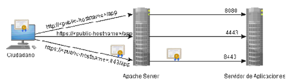

> *Este documento se ha migrado desde el original:
[Documentación/5 Manuales y documentación técnica/Documentación técnica/Instalación y Configuración/SGM_2012_10_Configuración para Apache - Tomcat.pdf](pdfs/SGM_2012_10_Configuración_para_Apache-Tomcat.pdf) en [https://github.com/e-admin/alsigm/releases/download/Documentacion/Documentacion_ALSIGM_3.0.rar](https://github.com/e-admin/alsigm/releases/download/Documentacion/Documentacion_ALSIGM_3.0.rar)*


## Introducción


### Visión general del sistema

AL SIGM es la plataforma de Tramitación Electrónica del MINETUR, solución integral
para la tramitación electrónica de los procedimientos administrativos, que fomenta la
interoperabilidad entre administraciones mediante su adaptación a estándares de
comunicación así como la reutilización de recursos e información pública.

### Finalidad del documento

Se trata de configurar el acceso al servidor de aplicaciones, que puede estar localizado
en una intranet, a través de otro servidor que sí es visible desde Internet.

En este caso en particular, el servidor de aplicaciones contiene las aplicaciones de AL
SIGM, mientras que para el servidor visible en Internet, que realiza las redirecciones,
se utiliza Apache Server. Aunque en principio, ambos servidores van a estar instalados
sobre la misma máquina física, en el caso de tener que usar máquinas separadas, la
configuración a aplicar sería idéntica.

Los puertos estándar HTTP y HTTPS son 80 y 443 respectivamente. Sin embargo,
algunas aplicaciones hacen uso de HTTPS en las modalidades sin y con autenticación
de cliente por certificado. El caso de AL SIGM es una de estas aplicaciones. Por esa
razón, se utiliza el puerto 843 (no estándar) para HTTPS con autenticación del cliente a
través de certificado.

Además también va a cambiar el puerto final de acceso al servidor de aplicaciones, con
respecto al puerto original utilizado por el usuario en la URL. En ese caso, los puertos
visibles desde Internet serán 80, 443 y 843 que se “redirigirán” respectivamente a los
puertos 8080, 4443 y 8443 del servidor de aplicaciones.

En el siguiente diagrama puede verse el objetivo a conseguir.



A continuación una breve descripción de cada uno de estos componentes:

**Ciudadano**: Utiliza la aplicación web a través de un navegador, accediendo a la URL
visible desde Internet, por medio de los puertos 80, 443 y 843.

**Apache Server**: Actúa como Proxy Inverso, es decir, se trata del servidor intermedio
visible desde Internet, que se encargará de lanzar las peticiones al servidor de
aplicaciones, a partir de la petición original recibida del ciudadano, y devolverle la
respuesta recibida de la aplicación. Todo este proceso se realiza de forma transparente
para ambos extremos de la comunicación. Además todos los enlaces incluidos en las
páginas web devueltas, en lugar de apuntar al servidor de aplicaciones, deben apuntar
a la URL visible desde Internet.

**Servidor de aplicaciones**: Contiene las aplicaciones web a las que necesita acceder
el ciudadano. Puede no ser visible por Internet. En el caso de usar HTTPs con
autenticación con certificado, el certificado enviado por el ciudadano al Apache Server,
debe ser redirigido al servidor de aplicaciones.


### Definiciones y Abreviaturas

A continuación se expone una tabla con los diferentes acrónimos y abreviaturas
utilizados a lo largo del documento, con su correspondiente definición.


|Acrónimo / Abreviatura | Definición |
|:----:|:----|
|MINETUR|Ministerio de Industria, Energía y Turismo|
|IECISA|Informática El Corte Inglés S.A.|
|SIGM|Sistema Integrado de Gestión de Expedientes Modular|
|AL|Administración Local|


## Configuración en AL SIGM
El objeto del este apartado es especificar los cambios que hay que realizar en la
configuración de SIGEM, para soportar un servidor web Apache configurado por
delante del Tomcat.

Para establecer un Apache por delante del Tomcat, habrá que realizar los siguientes
cambios en la configuración externalizada de SIGEM:

### SIGEM_Core

Modificar el fichero `SIGEM_Core/SIGEM_spring.properties` en el directorio de la
configuración externalizada.

Editar el fichero, estableciendo los puertos:

``` apache
[..]
#
# CONFIGURACION DE PUERTOS SIGEM
#
HTTP_PORT=8080
HTTPS_PORT=4443
CERT_PORT=8443
HTTP_FRONTEND_PORT=80
HTTPS_FRONTEND_PORT=443
HTTPS_FRONTEND_AUTHCLIENT_PORT=843
[..]

```


A continuación una breve explicación de cada propiedad:


|Nombre|Descripción|
|:----|:----|
|`HTTP_PORT`|Puerto HTTP del servidor de aplicaciones|
|`HTTP_PORT`|Puerto HTTPS del servidor de aplicaciones|
|`CERT_PORT`|Puerto HTTPS del servidor de aplicaciones para autenticación de cliente|
|`HTTP_FRONTEND_PORT`|Puerto HTTP del servidor HTTP|
|`HTTPS_FRONTEND_PORT`|Puerto HTTPS del servidor HTTP|
|`HTTPS_FRONTEND_AUTHCLIENT_PORT`|Puerto HTTPS del servidor HTTP para autenticación de cliente|


## Configuración de Apache Server

Editar el fichero de configuración del Apache, normalmente localizado en
`conf/httpd.conf`, y activar los módulos `mod_proxy`, `mod_ssl`, `mod_proxy_ajp`, que se
utilizarán para permitir al Apache interactuar con el servidor de aplicaciones con AL
SIGM:

``` apache
#
# Dynamic Shared Object (DSO) Support
# To be able to use the functionality of a module which was built as a DSO you
# have to place corresponding `LoadModule' lines at this location so the
# directives contained in it are actually available _before_ they are used.
# Statically compiled modules (those listed by `httpd -l') do not need
# to be loaded here.
#
#
# Example:
# LoadModule foo_module modules/mod_foo.so
#

LoadModule ssl_module modules/mod_ssl.so
LoadModule proxy_module modules/mod_proxy.so
LoadModule proxy_ajp_module modules/mod_proxy_ajp.so
```

Para poder usar otros ficheros adicionales de configuración en Apache, normalmente
localizados bajo el directorio conf/extra, es necesario incluirlos/activarlos, a través del
fichero principal de configuración. Por ejemplo, para activar un fichero de configuración
adicional para las conexiones SSL:

``` apache
# Secure (SSL/TLS) connections
Include conf/extra/httpd-ssl.conf
```

Es necesario crear un *HostVirtual* o *VirtualHost* en el Apache, para cada uno de los
puertos de escucha, ya que tienen configuraciones independientes. Además también
es necesario, verificar si el Apache está escuchando en el puerto correcto, y si no es
así añadir un `Listen <puerto>` en el fichero de configuración, sustituyendo la
etiqueta `<puerto>` con el puerto de escucha correspondiente.

**Nota**: En los ejemplos de los siguientes apartados, se utilizarán las etiquetas
`<HOSTNAME_SIGEM>`, para hacer referencia al nombre lógico del servidor con Apache
instalado y del mismo modo `<HOSTNAME_SIGEM>` para el servidor con AL SIGM.

**Nota2:** En los siguientes ejemplos por simplicidad se omite la configuración adicional
de logs que se puede usar para para monitorizar, auditar, depurar y/o registrar
errores en las conexiones y redirecciones realizadas desde el Apache. Se trata de los
parámetros:

|Nombre|Descripción|
|:----|:----|
|`ErrorLog`|Permite especificar el fichero donde Apache registrará cualquier error que detecte.|
|`CustomLog`|Permite especificar el fichero donde Apache registrará todas las peticiones que reciba.|
|`TransferLogs`|Idéntico al anterior pero no permite especificar, fomatos ni condiciones de log.|
|`LogLevel`|Permite especificar el tipo de mensajes que se van a enviar al log de errores.|
|`LogFormat`|Permite especificar el formato del log a utilizar y asociarle un nombre.|


Para más información sobre éste y otros parámetros del Apache del remite a la
documentación oficial.

### Puerto HTTP estándar (80)

Se utiliza la siguiente configuración:

``` apache
[...]
Listen 80
[...]
<VirtualHost *:80>
  ServerName        <HOSTNAME_APACHE>

  ProxyPass         / http://<HOSTNAME_SIGM3>:8080/
  ProxyPassReverse  / http://<HOSTNAME_SIGM3>:8080/
  ProxyPreserveHost On
</VirtualHost>
[...]
```

A continuación una breve explicación de cada uno de los parámetros utilizados:

* `VirtualHost`: Permite configurar las directivas que se aplicarán sólo a una combinación
específica de nombre de host y puerto. En este caso se utiliza `*` para indicar todas las
IPs y como puerto el visible desde Internet.

* `ServerName`: Especifica el nombre de host y opcionalmente puerto, que debe usar el
servidor para identificarse. Se utiliza al hacer redirecciones de URLs, si la máquina
tiene varios alias DNS.

* `ProxyPass`: Mapea URL relativas al servidor local, con URL absolutas del servidor de
aplicaciones. Se utiliza para transformar las URL recibidas, en las URL finales a usar
para acceder al servidor de aplicaciones.

* `ProxyPassReverse`: Permite ajustar las URL contenidas en las cabeceras `Location`,
`Content-Location` y `URI`, utilizadas en las respuestas HTTP de redirección. Necesario si
se configura el Apache como Proxy Inverso. Con esta propiedad no se reescriben URLs
en páginas web.

* `ProxyPreserveHost`: Permite que la línea Host, incluida en la petición recibida, se
envíe al servidor de aplicaciones, en lugar del nombre del host configurado en el
parámetro `ProxyPass`. Es útil, si desde el servidor de aplicaciones, se generan URL
absolutas que deben ser accesibles desde el equipo cliente. Puede valer `On` o `Off`.


### Puerto HTTPS estándar (443) sin autenticación de cliente
Se utiliza la siguiente configuración:

``` apache
[...]
Listen 443
[...]
<VirtualHost *:443>
  ServerName <HOSTNAME_APACHE>

  SSLEngine On
  SSLProxyEngine On

  ProxyRequests Off
  ProxyPreserveHost On

  SSLCertificateFile    /etc/apache2/ssl.crt/server.crt
  SSLCertificateKeyFile /etc/apache2/ssl.key/server.key

  ProxyPass        / https://<HOSTNAME_SIGM3>:4443/
  ProxyPassReverse / https://<HOSTNAME_SIGM3>:4443/
</VirtualHost>
[...]
```

A continuación una breve explicación de los nuevos parámetros utilizados en la
configuración:

* `SSLEngine`: Configurado a `On` para activar el uso de protocolos seguros (SSL/TLS) en ese host virtual.
* `SSLProxyEngine`: Permite activar el uso de protocolos seguros, para la funcionalidad de proxy inverso.
* `ProxyRequests`: Permite al Apache funcionar como un servidor proxy de redirección de peticiones. En el caso de usar un proxy inverso, debe valer `Off`.
* `SSLCertificateFile`: Ruta absoluta al fichero con codificación PEM, para el certificado/clave pública a usar en la comunicación SSL, entre el ciudadano y el servidor Apache.
* `SSLCertificateKeyFile`: Ruta absoluta al fichero con codificación PEM, para la clave
privada a usar en la comunicación SSL, entre el ciudadano y el servidor Apache.

### Puerto HTTPS con autenticación de cliente por certificado (843)

Se utiliza la siguiente configuración:
``` apache
[...]
Listen 843
[...]
<VirtualHost *:843>
  ServerName <HOSTNAME_APACHE>
 
  SSLEngine On
  SSLProxyEngine On

  ProxyPreserveHost On

  SSLCertificateFile    /etc/apache2/ssl.crt/server.crt
  SSLCertificateKeyFile /etc/apache2/ssl.key/server.key
  SSLProxyVerify require
  #SSLCACertificatePath /etc/apache2/ssl/
  SSLCACertificateFile  /etc/apache2/ssl/TodasCAConfiables.cer

  SSLVerifyClient require
  SSLVerifyDepth  2
  SSLOptions +ExportCertData +StdEnvVars

  AddDefaultCharset Off
  #ProxyPass        / http://<HOSTNAME_SIGM3>:8443/
  #ProxyPassReverse / ajp://<HOSTNAME_SIGM3>:8443/
  ProxyPass         / ajp://<HOSTNAME_SIGM3>:8009/
  ProxyPassReverse  / ajp://<HOSTNAME_SIGM3>:8009/
</VirtualHost>
[...]
SSLSessionCache nonenotnull
[...]
```

A continuación una breve explicación de los nuevos parámetros necesarios:

* `SSLProxyVerify`: Si vale `require`, indica que el servidor Apache va a comprobar el
certificado SSL utilizado por el servidor de aplicaciones remoto, sea válido antes de
establecer la comunicación.
	- **Nota**: Debido a que la propiedad SSLProxyVerifyDepth por defecto vale 1, con esta configuración se aceptan certificados autofirmados.

* `SSLCACertificateFile`: Permite especificar la ruta absoluta al fichero con formato PEM
que contedrá todas las claves públicas en las que se confía para establecer una
comunicación SSL con el cliente. Para más información sobre cómo generar este
fichero, consultar el Anexo de este documento.

* `SSLCACertificatePath`: Permite especificar la ruta absoluta al directorio que
contendrá ficheros con formato PEM para cada una de las claves públicas en las que se
confía para establecer una comunicación SSL con el cliente. Destacar cada fichero,
debe tener el nombre nombre asociado con el hash del certificado. Para más
información, consultar el Anexo de este documento.

* `SSLVerifyClient`: Si vale `require`, indica que para establecer una comunicación SSL
por ese puerto del Apache, desde el cliente se tiene que usar un certificado válido.

* `SSLVerifyDepth`: Especifica el nivel máximo de CAs intermedias que pueden tener los
certificados usados por el cliente, y que deben ser válidas. Se utiliza un valor 2 ya que
es que se necesita para validar los certificados FMNT y DNIe. Puede ser necesario
ajustar este parámetro.

* `SSLOptions`: Permite establecer directivas para el motor SSL utilizado en las
comunicaciones. En este caso es necesario usar:
	- `ExportCertData`: Permite que la información del certificado usado por el cliente, en la comunicación SSL con el servidor Apache, se transmita al servidor de aplicaciones remoto.
	- `StdEnvVars`: Genera una serie de variables de entorno SSL para el servidor, necesarias para el correcto envío del certificado al servidor de aplicaciones remoto.

* `AddDefaultCharset`: Establece el conjunto de caracteres de la codificación en la cabecera HTTP de la respuesta, sólo si el tipo de la misma es text/plain o text/html. Se desactiva, ya que la respuesta devuelta por el servidor ya tiene la codificación correcta.

	Señalar que aparecen comentadas las configuraciones `ProxyPass` y `ProxyPassReverse`, a través de HTTPS para destacar que para que el certificado utilizado por el ciudadano en la validación SSL sobre el servidor de Apache, sea enviado al servidor de aplicaciones remoto, es necesario el uso del conector AJP. Sino Apache va a tratar de establecer una nueva conexión SSL al puerto 8443 del servidor de aplicaciones, que fallará al no tener configurado en el Apache el certificado a usar en la validación SSL remota.

* `SSLSessionCache`: El valor por defecto para este parámetro (none) no es compatible con Internet Explorer si se utilizan autenticación SSL con certificado cliente. Por esta razón, es necesario establecerlo al valor `nonenotnull`, que también deshabilita el uso de la cache SSL de sesión, pero además envía un ID de sesión no nulo en cada
petición.
	Finalmente es necesario configurar en el servidor de aplicaciones, el conector AJP en el puerto 8009, para que redireccione las peticiones seguras, que en este caso incluirán la información del certificado, al puerto correspondiente (8443). En el caso de Tomcat:

``` xml
<Connector debug="0" enableLookups="false"
           port="8009" protocol="AJP/1.3" redirectPort="8443"/>
``` 


## ANEXO

### Creación de fichero de almacén de confianza SSL para Apache

Necesario si se configuran las Autoridades Certificadoras (CAs) en las que confía
Apache a través de la propiedad `SSLCACertificateFile`.

Se trata de un fichero con formato PEM donde estén concatenadas los diferentes
certificados de las CAs en las que se confía.

Una forma de generar este fichero es usar: `cat *.b64.cer > TodasCAConfiables.cer`

**Nota**: Para el correcto funcionamiento del comando anterior, es necesario que en ese
directorio, existan los ficheros correspondientes a la parte pública/certificados de las
diferentes CAs en formato PEM (base64), con extensión `b64.cert`.


### Creación de directorio de almacén de confianza SSL para Apache

Necesario si se configuran las Autoridades Certificadoras (CAs) en las que confía
Apache a través de la propiedad `SSLCACertificatePath`.

Se trata de un directorio que contendrá los certificados de todas las CAs en las que se
confía. Sin embargo, hay que renombrar cada uno de estos ficheros con el
hash que le corresponda a cada certificado.

Para obtener el hash de cada certificado hay que usar `openssl` ejemplo:
``` bash
openssl x509 -noout -hash -in /etc/apache2/ssl/FNMTClase2CA-FNMT.crt
``` 

