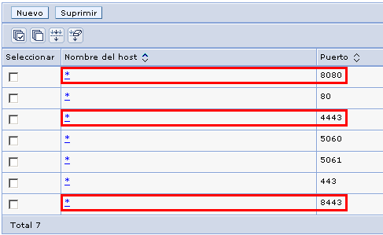

> *Este documento se ha migrado desde el original:
[Documentación/5 Manuales y documentación técnica/Documentación técnica/Instalación y Configuración/SGM_2012_10_Configuración para Websphere 6.1.pdf](pdfs/SGM_2012_10_Configuración_para_Websphere_6.1.pdf) en [https://github.com/e-admin/alsigm/releases/download/Documentacion/Documentacion_ALSIGM_3.0.rar](https://github.com/e-admin/alsigm/releases/download/Documentacion/Documentacion_ALSIGM_3.0.rar)*


## Introducción


### Visión general del sistema

AL SIGM es la plataforma de Tramitación Electrónica del MINETUR, solución integral
para la tramitación electrónica de los procedimientos administrativos, que fomenta la
interoperabilidad entre administraciones mediante su adaptación a estándares de
comunicación así como la reutilización de recursos e información pública.

### Finalidad del documento

El presente documento contiene la información necesaria para configurar el servidor de
aplicaciones Websphere 6.1 para la correcta ejecución de las aplicaciones
proporcionadas con AL SIGM. Es necesario revisar en primer lugar el documento
general de instalación de AL SIGM y configurar las particularidades de Websphere
siguiendo éste documento.


### Definiciones y Abreviaturas

A continuación se expone una tabla con los diferentes acrónimos y abreviaturas
utilizados a lo largo del documento, con su correspondiente definición.


|Acrónimo / Abreviatura | Definición |
|:----:|:----|
|MINETUR|Ministerio de Industria, Energía y Turismo|
|IECISA|Informática El Corte Inglés S.A.|
|SIGM|Sistema Integrado de Gestión de Expedientes Modular|
|AL|Administración Local|


## Configuración del servidor de aplicaciones


### Consideraciones iniciales

Este documento se ha realizado para la versión 6.1 de Websphere Application Server.
Es recomendable actualizar la versión de Websphere a la última disponible en la
versión 6.1, en el momento actual 6.1.0.45.

### Configuración externalizada

Para que las aplicaciones de AL SIGM puedan acceder a la configuración externalizada
de AL SIGM es necesario definir una librería compartida a nivel de servidor que
utilizarán todas las aplicaciones de SIGEM. Para ello debemos realizar los siguientes
pasos:

1. Copiar el fichero `sigem_configLocation.jar` al directorio lib del servidor de
aplicaciones.
2. Acceder a la consola administrativa de Websphere. Ir a *Entorno -> Variables compartidas*. Crear una nueva variable con los siguientes datos:
	* Nombre: `sigemConfigLocation`
	* Classpath: `${WAS_LIBS_DIR}/sigem_configLocation.jar`

3. Ir a *Servidores -> Servidores de aplicaciones -> Seleccionar la instancia de servidor*.
4. Ir a la opción *Infraestructura del servidor -> Java y gestión de procesos -> Cargador de clases*.
5. Si no hay ninguno creado crear uno nuevo con *"Orden de cargadores de clases: Clases cargadas con cargador de clases padre primero"*
6. En el cargador de clases ir a *Propiedades adicionales -> Referencias de bibliotecas compartidas* y anadir la anteriormente creada con nombre `sigemConfigLocation`
7. Guardar los cambios en la configuración maestra.


### Definición de orígenes de datos

En Websphere 6.1 los orígenes de datos se definen en la opción *Recursos -> JDBC -> Orígenes de datos*.

Antes de definir los orígenes de datos es necesario definir un proveedor de JDBC. Para
ello deberemos ir a la opción *Recursos -> JDBC -> Proveedores de JDBC*. Si el
proveedor no existe para la base de datos en concreto deberemos crear uno nuevo y
proporcionar la siguiente información:

* Nombre: nombre del proveedor *(por ejemplo: Sql Server JDBC 2.0)*
* Descripción: descripción del proveedor *(por ejemplo: Sql Server JDBC 2.0)*
* Classpath: ruta en la que se encuentra el driver jdbc previamente copiado *(por ejemplo: `${WAS_LIBS_DIR}/sqlserver/sqljdbc.jar`)*
* Nombre de clase de implementación: nombre de la clase de implementación, para obtenerla revisar la documentación del driver Jdbc *(por ejemplo: `com.microsoft.sqlserver.jdbc.SQLServerConnectionPoolDataSource `)*

A continuación ya podemos definir los orígenes de datos. Para ello realizaremos los
siguientes pasos (para un origen de datos para SQL Server y driver jdbc `sqljdbc.jar`,
para otros drivers JDBC consultar la documentación de Websphere y del driver JDBC):


1. Ir a *Recursos -> JDBC -> Orígenes de datos* y crear uno mediante el botón *Nuevo* proporcionando los siguientes datos:
	* Nombre de origen de datos, *por ejemplo archivoDS_000*
	* Nombre JNDI, *por ejemplo jdbc/archivoDS_000*
2. Mediante el botón *Siguiente* accedemos a la pantalla de selección de *Proveedor de JDBC*, aquí seleccionamos uno de los existentes, *por ejemplo Sql Server JDBC 2.0*
3. Mediante el botón *Siguiente* accedemos a la pantalla de *Propiedades específicas de la base de datos* y para terminar pulsaremos sobre *Finalizar*.
4. Una vez creado seleccionaremos el origen de datos e iremos a *Elementos relacionados -> JAAS - Datos de autenticación J2C*. Crearemos uno nuevo con Id de usuario el usuario de base de datos y Contraseña la contraseña de ese usuario.
5. Una vez creado seleccionaremos el origen de datos y proporcionaremos el resto de datos necesarios:
	* Nombre de la base de datos, *por ejemplo SIGM_3_TEST_ARCHIVO_000*
	* Nombre de servidor, *por ejemplo 13.228.54.54*
	* Alias de autenticación gestionado por componentes: el anteriormente creado
6. Guardaremos los cambios en la configuración maestra y mediante el botón *Conexión de prueba* podremos comprobar si el datasource está bien configurado.

Realizaremos la operación anterior para todos los orígenes de datos necesarios.


### Activación de SSL en el servidor de aplicaciones

AL SIGM necesita que esté activo SSL en el servidor de aplicaciones. Por defecto los
puertos utilizados son los siguientes:


|Puerto|Descripción|
|:----|:----|
|8080|Puerto HTTP|
|8443|Puerto HTTP seguro con autenticación de cliente|
|4443|Puerto HTTP seguro sin autenticación de cliente|


Para configurar los puertos debemos realizar varias operaciones:

1. Acceder a la consola administrativa de Websphere.
2. Ir a la sección *Entorno -> Hosts virtuales -> default_host -> Propiedades adicionales -> Alias de host* y asegurarse de que existen los puertos 8080, 4443 y 8443, si alguno de ellos no existiese los daríamos de alta con los siguientes datos:
	* Nombre: *
	* Puerto: el puerto en concreto
	
3. Ir a la sección *Seguridad -> Certificado SSL y gestión de claves -> Elementos relacionados -> Almacenes de claves y certificados* y crear los siguientes:
	* `SigemDefaultKeystore`: almacén con el certificado de servidor para establecer las conexiones SSL. Previamente habremos creado u obtenido el almacén con el certificado de servidor (normalmente un fichero `.pfx` o `.p12`).
	El almacén se creará con los siguientes datos:
		- Nombre: `SigemDefaultKeystore`
		- Vía de acceso: `C:\home\sigem\SIGEM\certificados\SigemDefaultKeystore.p12` (o la que corresponda)
		- Contraseña: `sigem` (o la que corresponda)
		- Confirmar contraseña: `sigem` (o la que corresponda)
		- Tipo: `PKCS12`
	* `SigemDefaultTruststore`: almacén de confianza para guardar las claves públicas de los certificados en los que confía el servidor. Previamente habremos creado u obtenido el almacén de confianza (normalmente un fichero .jks) e insertado en él las entidades raíz e intermedias de los certificados que se desean activar para autenticación con certificado de cliente (con la herramienta ikeyman de Websphere por ejemplo). 
	El almacén se creará con los siguientes datos:
		- Nombre: `SigemDefaultTruststore`
		- Vía de acceso: `C:\home\sigem\SIGEM\certificados\SigemDefaultTruststore.jks` (o la que corresponda)
		- Contraseña: `sigem` (o la que corresponda)
		- Confirmar contraseña: `sigem` (o la que corresponda)
		- Tipo: `PKCS12`
4. Guardar la configuración maestra.
5. Ir a la sección *Seguridad -> Certificado SSL y gestión de claves -> Elementos relacionados -> Configuraciones SSL* y crear una nueva con los siguientes datos:
	* Nombre: `SigemDefaultSSLSettings`
	* Nombre de almacén de confianza: `SigemDefaultTruststore`
	* Nombre de almacén de claves: `SigemDefaultKeystore`
	* Alias de certificado de servidor por omisión: obtenerlo mediante el botón *"Obtener alias de certificado"*
	* Alias de certificado de cliente por omisión: obtenerlo mediante el botón *"Obtener alias de certificado"*
6. Ir a la sección *Seguridad -> Certificado SSL y gestión de claves -> Elementos relacionados -> Configuraciones SSL* y crear una nueva con los siguientes datos:
	* Nombre: `SigemDefaultClientAuthSSLSettings`
	* Nombre de almacén de confianza: `SigemDefaultTruststore`
	* Nombre de almacén de claves: `SigemDefaultKeystore`
	* Alias de certificado de servidor por omisión: obtenerlo mediante el botón *"Obtener alias de certificado"*
	* Alias de certificado de cliente por omisión: obtenerlo mediante el botón *"Obtener alias de certificado"*
7. Guardar la configuración maestra.
8. En la lista de *Configuraciones SSL* acceder a la configuración `SigemDefaultSSLSettings` e ir a la opción *Propiedades adicionales -> Gestores de confianza y claves* y establecer los siguientes guardando la configuración:
	* Gestor de confianza por omisión: `IbmX509`
	* Gestor de claves: `IbmX509`
9. Guardar la configuración maestra.
10. En la lista de  *Configuraciones SSL* acceder a la configuración `SigemDefaultClientAuthSSLSettings` e ir a la opción *Propiedades adicionales -> Gestores de confianza y claves* y establecer los siguientes guardando la configuración:
	* Gestor de confianza por omisión: `IbmX509`
	* Gestor de claves: `IbmX509`
11. En la lista de *Configuraciones SSL* acceder a la configuración `SigemDefaultClientAuthSSLSettings` e ir a la opción *Propiedades adicionales -> Valores QoP (Calidad de protección)* y establecer los siguientes valores guardando la configuración:
	* Autenticación de cliente: Necesaria
12. Guardar la configuración maestra.
13. Ir a la opción *Servidores -> Servidores de aplicaciones -> server1 -> Puertos* y dar de alta/modificar los siguientes:
	* `WC_defaulthost`:
		- Host: *
		- Puerto: 8080

	* `WC_defaulthost_secure`:
		- Host: *
		- Puerto: 4443

	* `WC_defaulthost_secure_client_auth`:
		- Host: *
		- Puerto: 8443
14. Guardar la configuración maestra.
15. Ir a la opción *Servidores -> Servidores de aplicaciones -> server1 -> Valores del contenedor ->  Valores del contenedor Web -> Cadenas de transporte del contenedor Web* y dar de alta/modificar las siguientes:
	* Nombre de cadena de transporte: `WCInboundDefaultSecure`
	* Plantilla de cadena de transporte: `WebContainer-Secure` (`templates/chains|webcontainer-chains.xml#Chain_2`)
	* Utilizar puerto existente: `WC_defaulthost_secure` (\*:4443).
16. Guardar la configuración maestra.
17. Ir a la opción *Servidores -> Servidores de aplicaciones -> server1 -> Valores del contenedor ->  Valores del contenedor Web -> Cadenas de transporte del contenedor Web* y dar de alta/modificar las siguientes:
	* Nombre de cadena de transporte: `WCInboundDefaultSecureClientAuth`
	* Plantilla de cadena de transporte: `WebContainer-Secure` (`templates/chains|webcontainer-chains.xml#Chain_2`)
	* Utilizar puerto existente: `WC_defaulthost_secure_client_auth` (\*:8443).
18. Guardar la configuración maestra.
19. Ir a la opción *Servidores -> Servidores de aplicaciones -> server1 -> Valores del contenedor ->  Valores del contenedor Web -> Cadenas de transporte del contenedor Web*. En la lista acceder a *`WCInboundDefaultSecure` -> Canal de entrada SSL* y seleccionar como *Configuración SSL* `SigemDefaultSSLSettings`. En *Canal de entrada TCP* seleccionar como *Agrupación de hebras WebContainer*.
20. Guardar la configuración maestra.
21. Ir a la opción *Servidores -> Servidores de aplicaciones -> server1 -> Valores del contenedor ->  Valores del contenedor Web -> Cadenas de transporte del contenedor Web*. En la lista acceder a *`WCInboundDefaultSecureClientAuth` -> Canal de entrada SSL* y seleccionar como *Configuración SSL* `SigemDefaultClientAuthSSLSettings`. En *Canal de entrada TCP* seleccionar como *Agrupación de hebras WebContainer*.
22. Guardar la configuración maestra.

### Deshabilitar captcha en aplicación de Consulta de Documentos por Código Seguro de Verificación (CSV)

La aplicación de Consulta de Documentos por Código Seguro de Verificación (CSV)
utiliza una librería que da problemas de ejecución en la máquina de virtual de Java
versión 1.5, que es la que incluye Websphere 6.1. Para evitar éstos problemas es
necesario deshabilitar el uso de captcha en la configuración de dicha aplicación. Para
ello modificaremos el fichero `SIGEM_GestionCSVWeb\gestionCSVWebConfig.properties`
en el directorio donde tengamos la configuración
externalizada desactivando el uso de captcha:

```ini
#==========================================================
# Configuración de la aplicación Web requerida para el módulo ste-csv-webapp
#==========================================================
#
#

# URL de salida de la aplicación
#fwktd-csv-webapp.logout.url=http://<IP>:<PORT>/portal
fwktd-csv-webapp.logout.url=../portal

# Indica si se debe proteger la aplicación con un captcha
fwktd-csv-webapp.useCaptcha = false
```


### Ficheros policy IBM SDK

Las SDK de IBM se proporcionan con ficheros policy restringidos por las políticas de
seguridad criptográfica de los Estados Unidos. Para eliminar éstas restricciones IBM
proporciona dos jars (`local_policy.jar` y `US_export_policy.jar`) que se deben copiar al
directorio de la sdk que ejecuta Websphere, éste directorio se encuentra normalmente
en el directorio `AppServer/java/jre/lib/security`. 
El zip lo podemos obtener de la dirección siguiente:

[http://publib.boulder.ibm.com/infocenter/javasdk/v6r0/topic/com.ibm.java.security.component.doc/security-component/sdkpolicyfiles.html](http://publib.boulder.ibm.com/infocenter/javasdk/v6r0/topic/com.ibm.java.security.component.doc/security-component/sdkpolicyfiles.html)

### Despliegue de aplicaciones

Los ficheros war correspondientes a las aplicaciones de AL SIGM se deben renombrar
para evitar problemas de despliegue en Websphere, pero teniendo en cuenta que el
contexto de cada aplicación desplegada debe ser el original. En la siguiente tabla se
muestra el nombre original del war, el nombre renombrado para su despliegue en
Websphere y el contexto a utilizar para cada aplicación:


|Nombre original|Nombre renombrado|Contexto|
|:----|:----|:----|
|fwktdsirWS.war|fwktdsirWS.war|fwktdsirWS|
|portal.war|portal.war|portal|
|SIGEM_AdministracionSesionesAdmWS.war|SIGEM_AdmSesAdmWS.war|SIGEM_AdministracionSesionesAdmWS|
|SIGEM_AdministracionSesionesBackOfficeWS.war|SIGEM_AdmSesBOWS.war|SIGEM_AdministracionSesionesBackOfficeWS|
|SIGEM_AdministracionUsuariosWeb.war|SIGEM_AdmUsrWeb.war|SIGEM_AdministracionUsuariosWeb|
|SIGEM_AdministracionWeb.war|SIGEM_AdmWeb.war|SIGEM_AdministracionWeb|
|SIGEM_AntivirusWS.war|SIGEM_AntivirusWS.war|SIGEM_AntivirusWS|
|SIGEM_ArchivoWeb.war|SIGEM_ArchivoWeb.war|SIGEM_ArchivoWeb|
|SIGEM_AutenticacionAdministracionWeb.war|SIGEM_AutAdminWeb.war|SIGEM_AutenticacionAdministracionWeb|
|SIGEM_AutenticacionBackOfficeWeb.war|SIGEM_AutBOWeb.war|SIGEM_AutenticacionBackOfficeWeb|
|SIGEM_AutenticacionUsuariosWS.war|SIGEM_AutUsrWS.war|SIGEM_AutenticacionUsuariosWS|
|SIGEM_AutenticacionWeb.war|SIGEM_AutWeb.war|SIGEM_AutenticacionWeb|
|SIGEM_BuscadorDocsWeb.war|SIGEM_BuscadorDocsWeb.war|SIGEM_BuscadorDocsWeb|
|SIGEM_CalendarioWS.war|SIGEM_CalendarioWS.war|SIGEM_CalendarioWS|
|SIGEM_CatalogoProcedimientosWeb.war|SIGEM_CatProcsWeb.war|SIGEM_CatalogoProcedimientosWeb|
|SIGEM_CatalogoTramitesWeb.war|SIGEM_CatTramWeb.war|SIGEM_CatalogoTramitesWeb|
|SIGEM_CatalogoTramitesWS.war|SIGEM_CatTramWS.war|SIGEM_CatalogoTramitesWS|
|SIGEM_CatastroWeb.war|SIGEM_CatastroWeb.war|SIGEM_CatastroWeb|
|SIGEM_CatastroWS.war|SIGEM_CatastroWS.war|SIGEM_CatastroWS|
|SIGEM_CertificacionWeb.war|SIGEM_CertificacionWeb.war|SIGEM_CertificacionWeb|
|SIGEM_CertificacionWS.war|SIGEM_CertificacionWS.war|SIGEM_CertificacionWS|
|SIGEM_ConsultaExpedienteBackOfficeWeb.war|SIGEM_CnsExpBckOfWeb.war|SIGEM_ConsultaExpedienteBackOfficeWeb|
|SIGEM_ConsultaRegistroTelematicoBackOfficeWeb.war|SIGEM_CnsRgTelBckOfWeb.war|SIGEM_ConsultaRegistroTelematicoBackOfficeWeb|
|SIGEM_ConsultaRegistroTelematicoWeb.war|SIGEM_CnsRgTelWeb.war|SIGEM_ConsultaRegistroTelematicoWeb|
|SIGEM_ConsultaWeb.war|SIGEM_ConsultaWeb.war|SIGEM_ConsultaWeb|
|SIGEM_ConsultaWS.war|SIGEM_ConsultaWS.war|SIGEM_ConsultaWS|
|SIGEM_CriptoValidacionWS.war|SIGEM_CriptoValWS.war|SIGEM_CriptoValidacionWS|
|SIGEM_EntidadesWS.war|SIGEM_EntidadesWS.war|SIGEM_EntidadesWS|
|SIGEM_EstructuraOrganizativaWS.war|SIGEM_EstructOrgWS.war|SIGEM_EstructuraOrganizativaWS|
|SIGEM_EstructuraWeb.war|SIGEM_EstructuraWeb.war|SIGEM_EstructuraWeb|
|SIGEM_FirmaDigitalWS.war|SIGEM_FirmaDigitalWS.war|SIGEM_FirmaDigitalWS|
|SIGEM_GeoLocalizacionWeb.war|SIGEM_GeoLocalWeb.war|SIGEM_GeoLocalizacionWeb|
|SIGEM_GeoLocalizacionWS.war|SIGEM_GeoLocalWS.war|SIGEM_GeoLocalizacionWS|
|SIGEM_GestionCSVWeb.war|SIGEM_GestionCSVWeb.war|SIGEM_GestionCSVWeb|
|SIGEM_GestionCSVWS.war|SIGEM_GestionCSVWS.war|SIGEM_GestionCSVWS|
|SIGEM_MensajesCortosWS.war|SIGEM_MensajesCortosWS.war|SIGEM_MensajesCortosWS|
|SIGEM_NotificacionUpdaterWeb.war|SIGEM_NotUpdWeb.war|SIGEM_NotificacionUpdaterWeb|
|SIGEM_NotificacionWeb.war|SIGEM_NotificacionWeb.war|SIGEM_NotificacionWeb|
|SIGEM_NotificacionWS.war|SIGEM_NotificacionWS.war|SIGEM_NotificacionWS|
|SIGEM_PagoElectronicoWeb.war|SIGEM_PagoElectWeb.war|SIGEM_PagoElectronicoWeb|
|SIGEM_PagoElectronicoWS.war|SIGEM_PagoElectWS.war|SIGEM_PagoElectronicoWS|
|SIGEM_PublicadorWeb.war|SIGEM_PublicadorWeb.war|SIGEM_PublicadorWeb|
|SIGEM_PublicadorWS.war|SIGEM_PublicadorWS.war|SIGEM_PublicadorWS|
|SIGEM_RdeWS.war|SIGEM_RdeWS.war|SIGEM_RdeWS|
|SIGEM_RegistroPresencialAdminWeb.war|SIGEM_RegPrelAdmWeb.war|SIGEM_RegistroPresencialAdminWeb|
|SIGEM_RegistroPresencialWeb.war|SIGEM_RegPresWeb.war|SIGEM_RegistroPresencialWeb|
|SIGEM_RegistroPresencialWS.war|SIGEM_RegPresWS.war|SIGEM_RegistroPresencialWS|
|SIGEM_RegistroTelematicoDefaultTercerosConnectorWS.war|SIGEM_RgTelDefTerConWS.war|SIGEM_RegistroTelematicoDefaultTercerosConnectorWS|
|SIGEM_RegistroTelematicoWeb.war|SIGEM_RegistroTelWeb.war|SIGEM_RegistroTelematicoWeb|
|SIGEM_RegistroTelematicoWS.war|SIGEM_RegTelWS.war|SIGEM_RegistroTelematicoWS|
|SIGEM_RepositoriosDocumentalesWeb.war|SIGEM_RepDocWeb.war|SIGEM_RepositoriosDocumentalesWeb|
|SIGEM_SchedulerWeb.war|SIGEM_SchedulerWeb.war|SIGEM_SchedulerWeb|
|SIGEM_ServicioIntermediacionClienteLigeroWS.war|SIGEM_SrvIntClLigWS.war|SIGEM_ServicioIntermediacionClienteLigeroWS|
|SIGEM_SessionUsuarioWS.war|SIGEM_SesUsrWS.war|SIGEM_SessionUsuarioWS|
|SIGEM_SignoWS.war|SIGEM_SignoWS.war|SIGEM_SignoWS|
|SIGEM_TercerosWS.war|SIGEM_TercerosWS.war|SIGEM_TercerosWS|
|SIGEM_TramitacionWeb.war|SIGEM_TramitacionWeb.war|SIGEM_TramitacionWeb|
|SIGEM_TramitacionWS.war|SIGEM_TramitacionWS.war|SIGEM_TramitacionWS|


## Anexos

### Anexo1: Modificaciones de configuración

Por defecto con AL SIGM se proporciona una configuración para ejecución en Apache
Tomcat 7.0.16. Para la correcta ejecución de las aplicaciones de AL SIGM dentro de
Websphere 6.1 es necesario modificar los siguientes ficheros de configuración de la
configuración externalizada:

|Fichero | Modificación |
|:----|:----|
|`fwktd-audit/fwktd-audit-api.properties`<br>`fwktd-csv/fwktd-csv-api.properties`<br>`fwktd-dir3/fwktd-dir3-api.properties`<br>`fwktd-dm/fwktd-dm-config.xml`<br>`fwktd-sir/fwktd-sir-api.properties`<br>`SIGEM_ArchivoWeb/archivo-cfg.xml`<br>`SIGEM_Core/database.properties`<br>`SIGEM_Core/SIGEM_spring.properties`<br>`SIGEM_RegistroPresencial/hibernate.cfg.xml`<br>`SIGEM_RegistroPresencial/ISicres-Configuration.xml`<br>`SIGEM_RegistroPresencial/database.properties`<br>`SIGEM_Tramitacion/ispac.properties`<br>`SIGEM_Tramitacion/IDocStorageCfg.xml`|**Sustituir** ocurrencias de<br>`java:comp/env/jdbc/`<br>**por**<br>`jdbc:`|

