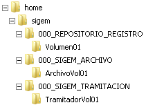
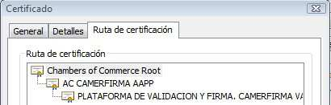
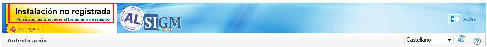
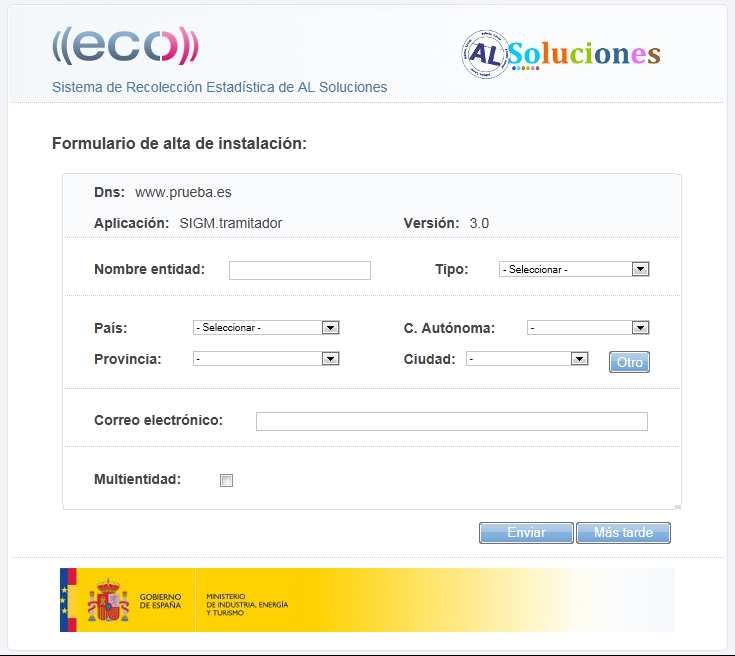
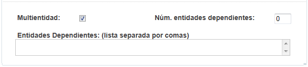
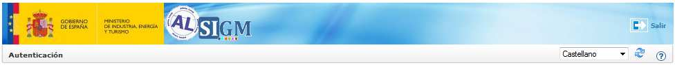

> *Este documento se ha migrado desde el original:
[Documentación/5 Manuales y documentación técnica/Documentación técnica/Instalación y Configuración/SGM_2012_10_Manual Instalación AL SIGM.pdf](pdfs/SGM_2012_10_Manual_Instalacion_ALSIGM.pdf) en [https://github.com/e-admin/alsigm/releases/download/Documentacion/Documentacion_ALSIGM_3.0.rar](https://github.com/e-admin/alsigm/releases/download/Documentacion/Documentacion_ALSIGM_3.0.rar)*


## Introducción


### Visión general del sistema

AL SIGM es la plataforma de Tramitación Electrónica del MINETUR, solución integral
para la tramitación electrónica de los procedimientos administrativos, que fomenta la
interoperabilidad entre administraciones mediante su adaptación a estándares de
comunicación así como la reutilización de recursos e información pública.

### Finalidad del documento

El presente documento contiene la información necesaria para instalar correctamente
AL SIGM. Se explica de manera general el proceso de instalación y se incluyen
referencias a documentos específicos para plataformas concretas.


### Definiciones y Abreviaturas

A continuación se expone una tabla con los diferentes acrónimos y abreviaturas
utilizados a lo largo del documento, con su correspondiente definición.


|Acrónimo / Abreviatura | Definición |
|:----:|:----|
|MINETUR|Ministerio de Industria, Energía y Turismo|
|IECISA|Informática El Corte Inglés S.A.|
|SIGM|Sistema Integrado de Gestión de Expedientes Modular|
|AL|Administración Local|


## Requisitos

Para poder instalar correctamente AL SIGM es necesario que ciertas herramientas
estén instaladas previamente:

1. **LibreOffice 3.3**: debe estar instalado y arrancado.
Para más información, se puede consultar el siguiente documento [Configuracion_LibreOffice_3.3](Configuración-LibreOffice-3.3.html)

2. **Servidor de FTP**, por ejemplo `vsftpd`. Los repositorios documentales mencionados
más adelante se deben crear en el directorio del usuario utilizado para conectar al
FTP (por defecto `/home/sigem` para un usuario sigem)

## Creación de esquemas de bases de datos

Para que las aplicaciones de AL SIGM funcionen correctamente es necesario que estén
definidos ciertos esquemas de base de datos. Los esquemas son los siguientes:


|Esquema|Descripción|Nombre del esquema por defecto|
|:----|:----|:----:|
|Registro Presencial (*registro*)|Esquema para la aplicación de Registro Presencial|registro_000|
|Gestión de Archivo (*archivo*)|Esquema para la aplicación de Gestión de Archivo|archivo_000|
|Tramitación Electrónica (*etramitacion*)|Esquema para la aplicación de Tramitación Electronica|eTramitacion_000|
|Administración (*sigemadmin*)|Esquema para la base de datos común de administración|sigemAdmin|
|Gestión de expedientes (*tramitador*)|Esquema para la aplicación de Gestión de Expedientes|tramitador_000|
|Componente de Consulta del Directorio Común (*dir3*)|Esquema para el componente de Consulta del Directorio Común|fwktd-dir3|
|Auditoría (*audit*)|Esquema para auditoría de las aplicaciones|fwktd-audit_000|
|Sistema de Interconexión de Registros (*sir*)|Esquema para el componente de Interconexión de Registros|fwktd-sir_000|

Para consultar como crear éstos esquemas y la manera de ejecutar los scripts de
forma manual para cada esquema se puede revisar el documento específico de cada
base de datos:

* [Configuración para PostgreSQL 9.0.3](Configuración-para-PostgreSQL-9.0.3.html)
* [Configuración para SQL Server 2008](Configuración-para-SQL-Server-2008.html)
* [Configuración para Oracle 11g](Configuración-para-Oracle-11g.html)
* [Configuración para DB2](Configuración-para-DB2.html)

Por otra parte si se desease ejecutar los scripts de forma automatizada para cada uno
de los esquemas se debería consultar el documento de la herramienta de inicialización
de base de datos:

* [Manual de Uso Herramienta Inicialización BBDD](../migración/Manual-de-Uso-Herramienta-Inicialización-BBDD.html)


## Repositorios documentales

Por defecto la instalación de AL SIGM incluye definiciones de repositorios documentales
que las aplicaciones utilizan para almacenar ficheros. Para que el almacenamiento de
ficheros se pueda realizar es necesario que estén creados ciertos directorios en la ruta
`/home/sigem`, en concreto se debería tener la siguiente estructura:




## Configuración del servidor de aplicaciones

### Driver JDBC

Dependiendo de la base de datos objeto de la instalación será necesario incluir en el
servidor de aplicaciones el driver JDBC propio de la base de datos en la ruta
correspondiente. En los documentos específicos de cada plataforma se indica ésta ruta:

* [Configuración para Jboss EAP 5.1.2](Configuración-para-Jboss-EAP-5.1.2.html)
* [Configuración para Tomcat 7.0.16](Configuración-para-Tomcat-7.0.16.html)
* [Configuración para Websphere 6.1](Configuración-para-Websphere-6.1.html)

### Configuración externalizada

Para que las aplicaciones de AL SIGM puedan acceder a la configuración externalizada
de AL SIGM es necesario copiar el jar `sigem_configLocation.jar` en una ruta concreta
para que el servidor de aplicaciones lo pueda cargar correctamente. Ésta ruta se indica
en cada uno de los documentos específicos de cada plataforma:

* [Configuración para Jboss EAP 5.1.2](Configuración-para-Jboss-EAP-5.1.2.html)
* [Configuración para Tomcat 7.0.16](Configuración-para-Tomcat-7.0.16.html)
* [Configuración para Websphere 6.1](Configuración-para-Websphere-6.1.html)

La ruta por defecto que se establece en dicho jar es `/home/sigem/SIGEM/conf`. Si se
quisiese modificar ésta ruta habría que manipular el jar `sigem_configLocation.jar`
estableciendo un valor a la propiedad `path` del fichero `configLocation.properties`
(incluido dentro de `configLocation.jar`).

La configuración externalizada se podría obtener de dos maneras:

1. A partir del fichero de configuración proporcionado por defecto con AL SIGM.
Habría que modificar cada uno de los ficheros de configuración especificados en
el Anexo: *"Modificaciones de configuración"* de cada uno de los documentos
específicos de cada plataforma:

	* [Configuración para Jboss EAP 5.1.2](Configuración-para-Jboss-EAP-5.1.2.html)
	* [Configuración para Tomcat 7.0.16](Configuración-para-Tomcat-7.0.16.html)
	* [Configuración para Websphere 6.1](Configuración-para-Websphere-6.1.html)

2. Automáticamente si se tiene el entorno de desarrollo correctamente instalado.
En éste caso revisar el siguiente documento para obtener una configuración
personalizada para cada plataforma:

	* [Manual de Uso Herramienta Configuraciones Básicas](../desarrollo/Manual-de-Uso-Herramienta-Configuraciones-Básicas.html)

En cualquiera de los dos casos anteriores habría que descomprimir el fichero
`sigem_config-*.zip` en el directorio deseado (por defecto `/home/sigem/SIGEM/conf`).


### Definición de datasources

Es necesario que estén creados ciertos datasources en el servidor de aplicaciones. A
continuación se muestra una tabla con los datasources necesarios:


|Nombre|Descripción|
|:----|:----|
|sigemAdmin|Datasource para la el esquema de administración|
|archivoDS_000|Datasource para el esquema de Gestión de Archivo|
|eTramitacionDS_000|Datasource para el esquema de Tramitación Electronica|
|tramitadorDS_000|Datasource para el esquema de Gestión de Expedientes|
|registroDS_000|Datasource para el esquema de Registro Presencial|
|tercerosDS_000|Datasource para el esquema de Terceros (es el mismo esquema que tramitadorDS_000) |
|fwktd-dir3DS|Datasource para el esquema del componente de Consulta del Directorio Común|
|fwktd-sirDS_000|Datasource para el esquema del componente de Interconexión de Registros|
|fwktd-auditDS_000| Datasource para el esquema del componente de auditoría de las aplicaciones|

Todos los datasources terminados en \_000 se deberían replicar en el caso de que en
AL SIGM se fuese a incorporar más entidades que la entidad por defecto.

Dependiendo del servidor de aplicaciones puede ser necesario asignar por cada
aplicación de AL SIGM los datasources correspondientes. En la siguiente tabla se indica
los datasources necesarios por aplicación:


|Aplicación|Datasources|
|:----|:----|
|SIGEM_AdministracionSesionesAdmWS|sigemAdmin
|SIGEM_AdministracionSesionesBackOfficeWS||
|SIGEM_AdministracionUsuariosWeb|eTramitacionDS_000<br>fwktd-auditDS_000 |
|SIGEM_AdministracionWeb|sigemAdmin<br>registroDS_000<br>tramitadorDS_000<br>fwktd-auditDS_000|
|SIGEM_ArchivoWeb|archivoDS_000<br>registroDS_000<br>tramitadorDS_000<br>tercerosDS_000<br>fwktd-auditDS_000|
|SIGEM_AutenticacionAdministracionWeb|sigemAdmin<br>registroDS_000<br>fwktd-auditDS_000|
|SIGEM_AutenticacionBackOfficeWeb|sigemAdmin<br>registroDS_000<br>fwktd-auditDS_000|
|SIGEM_AutenticacionUsuariosWS|eTramitacionDS_000<br>fwktd-auditDS_000|
|SIGEM_AutenticacionWeb|sigemAdmin<br>eTramitacionDS_000<br>fwktd-auditDS_000|
|SIGEM_CatalogoProcedimientosWeb|registroDS_000<br>tramitadorDS_000<br>fwktd-auditDS_000|
|SIGEM_CatalogoTramitesWS|eTramitacionDS_000<br>registroDS_000<br>fwktd-auditDS_000|
|SIGEM_CatalogoTramitesWeb|eTramitacionDS_000<br>registroDS_000<br>fwktd-auditDS_000<br>fwktd-dir3DS|
|SIGEM_CertificacionWS|eTramitacionDS_000<br>fwktd-auditDS_000|
|SIGEM_CertificacionWeb|eTramitacionDS_000<br>fwktd-auditDS_000|
|SIGEM_ConsultaWeb|eTramitacionDS_000<br>fwktd-auditDS_000|
|SIGEM_ConsultaExpedienteBackOfficeWeb|eTramitacionDS_000<br>registroDS_000<br>fwktd-auditDS_000|
|SIGEM_ConsultaWS|eTramitacionDS_000<br>fwktd-auditDS_000|
|SIGEM_CriptoValidacionWS||
|SIGEM_EntidadesWS|sigemAdmin|
|SIGEM_EstructuraWeb|sigemAdmin<br>registroDS_000<br>fwktd-auditDS_000|
|SIGEM_EstructuraOrganizativaWS|sigemAdmin<br>registroDS_000<br>fwktd-auditDS_000|
|SIGEM_FirmaDigitalWS||
|SIGEM_GeoLocalizacionWeb|sigemAdmin|
|SIGEM_GeoLocalizacionWS|sigemAdmin|
|SIGEM_NotificacionUpdaterWeb|sigemAdmin<br>sisnot<br>eTramitacionDS_000<br>fwktd-auditDS_000|
|SIGEM_NotificacionWS|sisnot<br>eTramitacionDS_000<br>fwktd-auditDS_000|
|SIGEM_NotificacionWeb|eTramitacionDS_000<br>fwktd-auditDS_000|
|SIGEM_PagoElectronicoWS|eTramitacionDS_000<br>fwktd-auditDS_000|
|SIGEM_PagoElectronicoWeb|eTramitacionDS_000<br>fwktd-auditDS_000|
|SIGEM_PublicadorWeb|sigemAdmin<br>sisnot<br>eTramitacionDS_000<br>registroDS_000<br>tramitadorDS_000<br>fwktd-auditDS_000|
|SIGEM_PublicadorWS|sigemAdmin<br>sisnot<br>eTramitacionDS_000<br>registroDS_000<br>tramitadorDS_000<br>tercerosDS_000<br>fwktd-auditDS_000|
|SIGEM_RdeWS|eTramitacionDS_000<br>fwktd-auditDS_000|
|SIGEM_RegistroPresencialAdminWeb|sigemAdmin<br>fwktd-dir3DS<br>registroDS_000<br>fwktd-auditDS_000|
|SIGEM_RegistroPresencialWS|fwktd-dir3DS<br>registroDS_000<br>fwktd-sirDS_000<br>fwktd-auditDS_000|
|SIGEM_RegistroPresencialWeb|fwktd-dir3DS<br>sigemAdmin<br>fwktd-sirDS_000<br>registroDS_000<br>fwktd-auditDS_000|
|SIGEM_RegistroTelematicoWS|eTramitacionDS_000<br>registroDS_000<br>tramitadorDS_000<br>fwktd-auditDS_000|
|SIGEM_RegistroTelematicoWeb|sigemAdmin<br>eTramitacionDS_000<br>registroDS_000<br>tramitadorDS_000<br>fwktd-auditDS_000|
|SIGEM_RegistroTelematicoDefaultTercerosConnectorWS|tercerosDS_000|
|SIGEM_ConsultaRegistroTelematicoWeb|eTramitacionDS_000<br>fwktd-auditDS_000|
|SIGEM_ConsultaRegistroTelematicoBackOfficeWeb|eTramitacionDS_000<br>registroDS_000<br>fwktd-auditDS_000|
|SIGEM_RepositoriosDocumentalesWeb|sigemAdmin<br>registroDS_000<br>fwktd-auditDS_000|
|SIGEM_SessionUsuarioWS|eTramitacionDS_000<br>fwktd-auditDS_000|
|SIGEM_TercerosWS|tercerosDS_000|
|SIGEM_TramitacionWS|eTramitacionDS_000<br>registroDS_000<br>tramitadorDS_000<br>fwktd-auditDS_000|
|SIGEM_TramitacionWeb|sigemAdmin<br>eTramitacionDS_000<br>registroDS_000<br>tramitadorDS_000<br>tercerosDS_000<br>fwktd-dir3DS<br>fwktd-sirDS_000<br>fwktd-auditDS_000|
|SIGEM_BuscadorDocsWeb|registroDS_000<br>tramitadorDS_000<br>fwktd-auditDS_000|
|SIGEM_MensajesCortosWS||
|SIGEM_SchedulerWeb|sigemAdmin<br>fwktd-dir3DS<br>registroDS_000<br>eTramitacionDS_000<br>fwktd-auditDS_000|
|SIGEM_CalendarioWS|eTramitacionDS_000<br>fwktd-auditDS_000|
|SIGEM_AntivirusWS|fwktdsirWS<br>fwktd-dir3DS<br>sigemAdmin<br>fwktd-sirDS_000|
|SIGEM_GestionCSVWS|fwktd-auditDS_000<br>eTramitacionDS_000|
|SIGEM_GestionCSVWeb|sigemAdmin<br>fwktd-auditDS_000<br>eTramitacionDS_000|
|SIGEM_SignoWS|sigemAdmin<br>eTramitacionDS_000<br>tramitadorDS_000<br>fwktd-auditDS_000|


Para el proceso de definición de datasources por cada servidor de aplicaciones se
puede consultar los documentos específicos de cada servidor:

* [Configuración para Jboss EAP 5.1.2](Configuración-para-Jboss-EAP-5.1.2.html)
* [Configuración para Tomcat 7.0.16](Configuración-para-Tomcat-7.0.16.html)
* [Configuración para Websphere 6.1](Configuración-para-Websphere-6.1.html)


### Directorio de logs

Por defecto los logs se almacenan en el directorio `/home/sigem/SIGEM/logs`. Si se
desea cambiar la ruta de logs se puede consultar el documento:

* [Descripción de ficheros de log](../soporte/Descripción-de-ficheros-de-log.html)

Para que no se produzca ningún error en el inicio de las aplicaciones con los directorios
de logs es necesario que en el directorio `/home/sigem/SIGEM/logs` estén creados los
siguientes subdirectorios:


* `fwktd-sir-ws`
* `SIGEM_AdministracionSesionesAdmWS`
* `SIGEM_AdministracionSesionesBackOfficeWS`
* `SIGEM_AdministracionUsuariosWeb`
* `SIGEM_AdministracionWeb`
* `SIGEM_AntivirusWS`
* `SIGEM_ArchivoWeb`
* `SIGEM_AutenticacionAdministracionWeb`
* `SIGEM_AutenticacionBackOfficeWeb`
* `SIGEM_AutenticacionUsuariosWS`
* `SIGEM_AutenticacionWeb`
* `SIGEM_BuscadorDocsWeb`
* `SIGEM_CalendarioWS`
* `SIGEM_CatalogoProcedimientosWeb`
* `SIGEM_CatalogoTramitesWeb`
* `SIGEM_CatalogoTramitesWS`
* `SIGEM_Catastro`
* `SIGEM_CatastroWS`
* `SIGEM_CertificacionWeb`
* `SIGEM_CertificacionWS`
* `SIGEM_ConsultaExpedienteBackOfficeWeb`
* `SIGEM_ConsultaRegistroTelematicoBackOfficeWeb`
* `SIGEM_ConsultaRegistroTelematicoWeb`
* `SIGEM_ConsultaWeb`
* `SIGEM_ConsultaWS`
* `SIGEM_CriptoValidacionWS`
* `SIGEM_EntidadesWS`
* `SIGEM_EstructuraOrganizativaWS`
* `SIGEM_EstructuraWeb`
* `SIGEM_FirmaDigitalWS`
* `SIGEM_GeoLocalizacionWeb`
* `SIGEM_GeoLocalizacionWS`
* `SIGEM_GestionCSVWeb`
* `SIGEM_GestionCSVWS`
* `SIGEM_MensajesCortosWS`
* `SIGEM_NotificacionUpdaterWeb`
* `SIGEM_NotificacionWeb`
* `SIGEM_NotificacionWS`
* `SIGEM_PagoElectronicoWeb`
* `SIGEM_PagoElectronicoWS`
* `SIGEM_PublicadorWeb`
* `SIGEM_PublicadorWS`
* `SIGEM_RdeWS`
* `SIGEM_RegistroPresencialAdminWeb`
* `SIGEM_RegistroPresencialWeb`
* `SIGEM_RegistroTelematicoDefaultTercerosConnectorWS`
* `SIGEM_RegistroTelematicoWeb`
* `SIGEM_RegistroTelematicoWS`
* `SIGEM_RepositoriosDocumentalesWeb`
* `SIGEM_SchedulerWeb`
* `SIGEM_ServicioIntermediacionClienteLigeroWS`
* `SIGEM_SessionUsuarioWS`
* `SIGEM_SignoWS`
* `SIGEM_TercerosWS`
* `SIGEM_TramitacionWeb`
* `SIGEM_TramitacionWS`

### Activación de SSL en el servidor de aplicaciones

AL SIGM necesita que esté activo SSL en el servidor de aplicaciones. Por defecto los
puertos utilizados son los siguientes:


|Puerto|Descripción|
|:----|:----|
|8080|Puerto HTTP|
|8443|Puerto HTTP seguro con autenticación de cliente|
|4443|Puerto HTTP seguro sin autenticación de cliente|

Para configurar SSL en cada servidor de aplicaciones se puede consultar los
documentos específicos:

* [Configuración para Jboss EAP 5.1.2](Configuración-para-Jboss-EAP-5.1.2.html)
* [Configuración para Tomcat 7.0.16](Configuración-para-Tomcat-7.0.16.html)
* [Configuración para Websphere 6.1](Configuración-para-Websphere-6.1.html)


### Configuración de los puertos en el fichero de propiedades

Los puertos que se configuren en el servidor de aplicaciones deben coincidir con los
puertos que se definan en un fichero de propiedades del módulo `SIGEM_Core`.
Este fichero de propiedades se puede localizar en la ruta
`SIGEM_Core/SIGEM_spring.properties` dentro de la configuración externalizada de AL
SIGM.

Se deben modificar los puertos en dicho fichero para coincidir con los definidos en el
servidor de aplicaciones. La parte de contenido del fichero que hace referencia a la
definición de los puertos es la siguiente:

```ini
##
## CONFIGURACION DE PUERTOS SIGEM
##
HTTP_PORT=8080
HTTPS_PORT=4443
CERT_PORT=8443
HTTP_FRONTEND_PORT=80
HTTPS_FRONTEND_PORT=443
HTTPS_FRONTEND_AUTHCLIENT_PORT=843
```

Los puertos HTTP_PORT, HTTPS_PORT y CERT_PORT deben coincidir con el puerto
HTTP, puerto HTTP seguro sin autenticación de cliente y puerto HTTP seguro con
autenticación de cliente definidos en el punto anterior.

Los puertos HTTP_FRONTEND_PORT, HTTPS_FRONTEND_PORT y HTTPS_FRONTEND_AUTHCLIENT_PORT se utilizan en el caso de que tengamos un servidor Web configurado, y serían respectivamente el puerto HTTP, puerto HTTP
seguro sin autenticación de cliente y puerto HTTP seguro con autenticación de cliente
definidos en el servidor Web.


### Despliegue de aplicaciones

A continuación se muestra una lista de las aplicaciones (war) que se proporcionan con
la distribución de AL SIGM:


* `fwktdsirWS.war`
* `portal.war`
* `SIGEM_AdministracionSesionesAdmWS.war`
* `SIGEM_AdministracionSesionesBackOfficeWS.war`
* `SIGEM_AdministracionUsuariosWeb.war`
* `SIGEM_AdministracionWeb.war`
* `SIGEM_AntivirusWS.war`
* `SIGEM_ArchivoWeb.war`
* `SIGEM_AutenticacionAdministracionWeb.war`
* `SIGEM_AutenticacionBackOfficeWeb.war`
* `SIGEM_AutenticacionUsuariosWS.war`
* `SIGEM_AutenticacionWeb.war`
* `SIGEM_BuscadorDocsWeb.war`
* `SIGEM_CalendarioWS.war`
* `SIGEM_CatalogoProcedimientosWeb.war`
* `SIGEM_CatalogoTramitesWeb.war`
* `SIGEM_CatalogoTramitesWS.war`
* `SIGEM_CatastroWeb.war`
* `SIGEM_CatastroWS.war`
* `SIGEM_CertificacionWeb.war`
* `SIGEM_CertificacionWS.war`
* `SIGEM_ConsultaExpedienteBackOfficeWeb.war`
* `SIGEM_ConsultaRegistroTelematicoBackOfficeWeb.war`
* `SIGEM_ConsultaRegistroTelematicoWeb.war`
* `SIGEM_ConsultaWeb.war`
* `SIGEM_ConsultaWS.war`
* `SIGEM_CriptoValidacionWS.war`
* `SIGEM_EntidadesWS.war`
* `SIGEM_EstructuraOrganizativaWS.war`
* `SIGEM_EstructuraWeb.war`
* `SIGEM_FirmaDigitalWS.war`
* `SIGEM_GeoLocalizacionWeb.war`
* `SIGEM_GeoLocalizacionWS.war`
* `SIGEM_GestionCSVWeb.war`
* `SIGEM_GestionCSVWS.war`
* `SIGEM_MensajesCortosWS.war`
* `SIGEM_NotificacionUpdaterWeb.war`
* `SIGEM_NotificacionWeb.war`
* `SIGEM_NotificacionWS.war`
* `SIGEM_PagoElectronicoWeb.war`
* `SIGEM_PagoElectronicoWS.war`
* `SIGEM_PublicadorWeb.war`
* `SIGEM_PublicadorWS.war`
* `SIGEM_RdeWS.war`
* `SIGEM_RegistroPresencialAdminWeb.war`
* `SIGEM_RegistroPresencialWeb.war`
* `SIGEM_RegistroPresencialWS.war`
* `SIGEM_RegistroTelematicoDefaultTercerosConnectorWS.war`
* `SIGEM_RegistroTelematicoWeb.war`
* `SIGEM_RegistroTelematicoWS.war`
* `SIGEM_RepositoriosDocumentalesWeb.war`
* `SIGEM_SchedulerWeb.war`
* `SIGEM_ServicioIntermediacionClienteLigeroWS.war`
* `SIGEM_SessionUsuarioWS.war`
* `SIGEM_SignoWS.war`
* `SIGEM_TercerosWS.war`
* `SIGEM_TramitacionWeb.war`
* `SIGEM_TramitacionWS.war`

Para realizar el despliegue de cada una de las anteriores en el servidor de aplicaciones
se puede consultar los documentos específicos:


* [Configuración para Jboss EAP 5.1.2](Configuración-para-Jboss-EAP-5.1.2.html)
* [Configuración para Tomcat 7.0.16](Configuración-para-Tomcat-7.0.16.html)
* [Configuración para Websphere 6.1](Configuración-para-Websphere-6.1.html)

### Problemas con la generación de pdf

En ciertos entornos puede que haya problemas a la hora de generar los ficheros PDF,
para evitar estos errores es necesario añadir un parámetro a las opciones de arranque
Java del servidor. El parámetro en cuestión es `-Djava.awt.headless=true`


### Problema al crear ficheros en repositorios documentales

En algunos sistemas (se ha detectado el problema en Ubuntu por el momento) hay
problemas al crear ficheros en los repositorios documentales. El problema es debido a
que no se gestionan correctamente las conexiones a `127.0.0.1`, para solucionarlo se
deben realizar las siguientes acciones:

* Acceder al sistema mediante un usuario root.
* Observar el valor que devuelve la ejecución del siguiente comando:
```bash
hostname
```

* Añadir/modificar la siguiente línea en el fichero `/etc/hosts`:
```
127.0.0.1 localhost <valor_del_comando_anterior>
```

* Editar el fichero `/etc/vsftpd.conf` y realizar cualquiera de las dos operaciones siguientes (una de las dos):
	* Desactivar el modo pasivo del ftp. Para ello añadir/modificar la siguiente línea:
```ini
pasv_enable=NO
```

	* Establecer la dirección IP real del equipo, en éste caso `127.0.0.1`. Para ello añadir las líneas:
```ini
pasv_enable=YES
pasv_address=127.0.0.1
pass_min_port=30000
pass_max_port=30200
```

* Reiniciar vsftpd con el siguiente comando:
```bash
service vsftpd restart
```


### Configuración para soportar certificados de cliente
Los distintos módulos de SIGM permiten autenticación mediante certifico digital,
haciendo uso de comunicación SSL. Sin embargo, para poder establecer este tipo de
comunicación, es necesario que el servidor confíe en el certificado que va a ser
utilizado por los usuarios finales.

Para especificar los certificados en los que el servidor puede confiar, se utiliza un
almacén de confianza: se deben importar en este almacén los certificados de las
autoridades certificadoras, raíz e intermedias, de todos los certificados que se vayan a
aceptar.

Con el fin de aclarar este proceso, se incluye un ejemplo de la ruta de certificación
completa de un certificado:




La imagen anterior muestra la ruta de certificación completa de un certificado. En este
caso, *"Chambers of Commerce Root"* es la autoridad certificadora raíz, que a su vez es
emisora de ‘AC CAMERFIRMA AAPP’, que es una autoridad certificadora intermedia, y
emisora del certificado final utilizado por el usuario.

Para que el servidor aceptase este certificado, habría que importar en el almacén de
confianza los certificados de todas las autoridades certificadoras anteriores,
empezando desde la raíz. Aunque es posible que sea suficiente con importar sólo el
certificado de la entidad certificadora intermedia, emisora del certificado final, se
recomienda importar la cadena de certificación completa, con el fin de evitar algunos
errores que en ocasiones pueden aparecer al tratar de establecer la conexión SSL.

Una forma de conseguir lo anterior, es a través del fichero cacerts. Para localizarlo es
necesario en primer lugar identificar la máquina virtual que se encarga de arrancar el
servidor de aplicaciones. Una vez identificada ésta máquina virtual, generalmente se
puede localizar este fichero en el subdirectorio jre/lib/security.

Para importar los certificados de las autoridades certificadoras raíz e intermedias
emisoras de estos certificados al fichero cacerts, se usará la herramienta keytool
proporcionada por Java. A continuación se muestra un ejemplo para importar la raíz de
DNI Electrónico:

```bash
$JAVA_HOME/bin/keytool.exe \
     -import -keystore $JAVA_HOME/jre/lib/security/cacerts \
     -file $RUTA_CERTIFICADO_RAIZ_DNIE/AcRaizDNIe.cer -alias AcRaizDNIe 
```

Donde `$JAVA_HOME` es la ruta a la máquina virtual de Java usada por el servidor y
`$RUTA_CERTIFICADO_RAIZ_DNIE` indica la ubicación del fichero `AcRaizDNIe.cer` que
es el certificado raíz de los certificados de DNI Electrónico. Esta misma operación debe
hacerse con los certificados de las entidades intermedias.

En las nuevas versiones de java, se ha modificado la sintaxis de este comando,
siendo necesario ahora usar `-importcert` en lugar de  `-import`.

Es necesario reiniciar el servidor de aplicaciones una vez que se ha
cambiado el fichero cacerts.

## Configuración propia de AL SIGM

### Configuración general

Para realizar configuraciones específicas sobre aspectos generales a AL SIGM, se deben
consultar los siguientes documentos:

* Configuración para LDAP
* Configuración para la integración con Alfresco
* Configuración para Apache-Tomcat


### Configuración por módulo

Para la configuración específica de los distintos módulos y servicios de AL SIGM, se
deben consultar los siguientes documentos:

* Configuración Registro Telemático
* Configuración Notificación Telemática
* Configuración Pago Telemático
* Configuración Registro
* Configuración Gestión de Expedientes
* Configuración y Personalización Archivo
* Configuración Consulta Documentos por CSV
* Configuración del servicio de Catastro
* Configuración del servicio de GeoLocalización
* Configuración de CriptoValidación por Entidades
* Configuración de Firma Digital por Entidades
* Configuración de la Consolidación de Registro Telemático


### Configuración de integraciones con sistemas externos

Para la configuración específica de las integraciones incluidas en AL SIGM 3 con
sistemas externos, se deben consultar los siguientes documentos:

* Configuración para la integración con AL LocalGIS
* Configuración integración con Servicios de Intermediación de
Datos
* Configuración para la integración con ECO
* Configuración para la integración con SIGNO
* Configuración para la integración con SIR
* Configuración para la integración con Sisnot y Correos


## Registro de instancia de AL SIGM en ECO

Con el fin de controlar las implantaciones de AL SIGM que se han realizado, y en la
medida de lo posible, conocer estadísticas de su uso, se hará uso del Sistema de
Recolección de Estadísticas de las aplicaciones PALS (ECO) del Ministerio de Industria,
Energía y Turismo (MINETUR).

La integración con dicho sistema se realiza en la cabecera de la página de inicio de las
aplicaciones de back office y del ciudadano incluidas en AL SIGM, de manera que se
muestre en ella una imagen con el logotipo del MINETUR, para instancias registradas,
o una imagen con un enlace a un formulario de registro, en caso contrario.

El registro de una instancia de AL SIGM en ECO se hará a nivel de implantación, para
los siguientes módulos:

* Aplicaciones para el ciudadano
* Registro Presencial
* Gestión de Expedientes
* Archivo

Sólo se realizará un registro por implantación; para las organizaciones que den soporte
multientidad, se indicará en el propio formulario de registro el número de entidades
soportadas, y adicionalmente los nombres de las mismas.

* Para realizar el registro del cada módulo de AL SIGM que vaya a ser usado en una
instancia concreta, se deberá acceder, tras la instalación de la plataforma, a la página
de login de las aplicaciones correspondientes a los módulos a registrar:

* Para registrar el uso del módulo de aplicaciones del ciudadano, a cualquiera de
las páginas de login para los trámites electrónicos disponibles en el portal, o de
las aplicaciones de consulta para el ciudadano.


* Para registrar el uso del módulo de registro, a la página de login de la
Aplicación de Registro.

* Para registrar el uso del módulo de expedientes, a la página de login de la
Tramitación de Expedientes.

* Para registrar el uso del módulo de archivo, a la página de login de la Aplicación
de Archivo.


Se deberá realizar un registro por cada módulo a ser usado.

En la cabecera de la página de login correspondiente, aparecerá una imagen con un
enlace al formulario de registro de ECO.



Se deberán realizar las siguientes acciones:

1. Seleccionar el enlace *"Instalación no registrada. Pulse aquí para acceder al
formulario de registro"* que aparecerá en la cabecera de la página.

2. En el formulario de acceso a ECO que se mostrará a continuación (en nueva
ventana), introducir un usuario y contraseña válidos. Por defecto, estos valores serán:
```ini
Usuario = instalador
Contraseña = instalador
```

	En esta página, además, se mostrará un teléfono y un enlace a un formulario web de consultas, a través de los cuales podrán solicitarse estas credenciales en caso de no disponerse de las mismas. 

3. En el formulario mostrado tras acceder a ECO, cumplimentar los datos de la
implantación AL SIGM. Dicho formulario recogerá de manera automática desde la
página de login correspondiente, el módulo que se está registrando.

	

	Para las instalaciones multientidad, se deberá cumplimentar adicionalmente la siguiente información:

	

4. Una vez cumplimentado el formulario, se pulsará el botón Enviar. Como resultado se recibirá una clave necesaria para realizar posteriores cambios en la información de registro. 

5. Al final de dicho proceso se deberá cerrar la ventana correspondiente a ECO, y volver a la que muestra el login de AL SIGM.

6. Para comprobar que el registro se ha realizado correctamente, al recargar o volver a abrir la ventana de login para la aplicación de AL SIGM que se acaba de registrar, debe aparecer en la cabecera de la misma la imagen del logo del MINETUR. 

	


