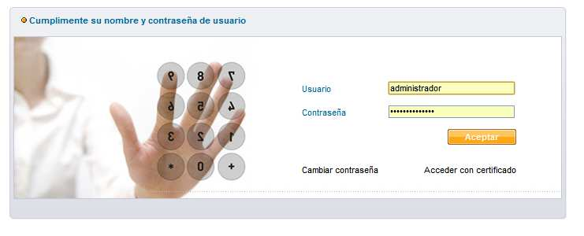
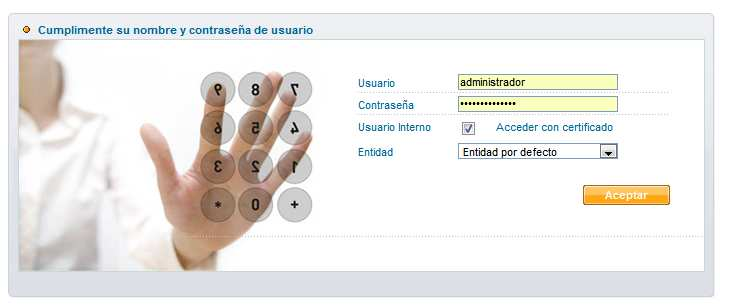
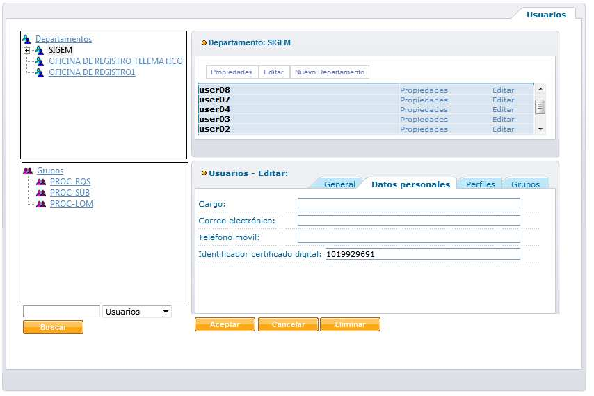
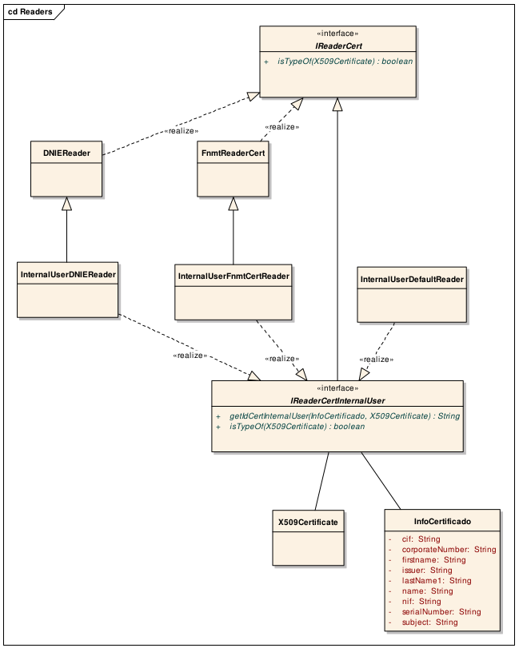

> *Este documento se ha migrado desde el original:
[Documentación/5 Manuales y documentación técnica/Documentación técnica/Guías y ayudas/SGM_2012_10_Autenticación con Certificado en BackOffice y Administración.pdf](pdfs/SGM_2012_10_Autenticacion_con_Certificado_en_BackOffice_y_Administracion.pdf) en [https://github.com/e-admin/alsigm/releases/download/Documentacion/Documentacion_ALSIGM_3.0.rar](https://github.com/e-admin/alsigm/releases/download/Documentacion/Documentacion_ALSIGM_3.0.rar)*


## Introducción


### Visión general del sistema

AL SIGM es la plataforma de Tramitación Electrónica del MINETUR, solución integral
para la tramitación electrónica de los procedimientos administrativos, que fomenta la
interoperabilidad entre administraciones mediante su adaptación a estándares de
comunicación así como la reutilización de recursos e información pública.

### Finalidad del documento

La versión 3.0 de AL SIGM incluye, en las respectivas aplicaciones web de
autenticación, tanto para las aplicaciones de Administración como para las de
Gestión/BackOffice, la posibilidad de que un usuario interno acceda a dichas
aplicaciones mediante un certificado digital.

Para ello, en el conjunto de datos personales definidos para los usuarios internos en
la Estructura Organizativa, se incluirá la información que permita vincular el
certificado digital con dichos usuarios, para identificarlos.

Se modificará el proceso de autenticación para los usuarios internos, para permitir
el acceso con certificado digital: en dicho caso, se obtendrá del certificado usado
para la autenticación el valor del campo definido como identificador, haciendo uso
de un conector, y se buscará en la información almacenada en la Estructura
Organizativa el usuario correspondiente a dicho identificador.

El objeto de este manual es describir dicho proceso de autenticación de usuarios
internos en las aplicaciones de backoffice y administración mediante certificado
digital, y definir cómo se pueden implementar nuevos conectores para la extracción
del identificador de un certificado digital.

### Definiciones y Abreviaturas

A continuación se expone una tabla con los diferentes acrónimos y abreviaturas
utilizados a lo largo del documento, con su correspondiente definición.


|Acrónimo / Abreviatura | Definición |
|:----:|:----|
|MINETUR|Ministerio de Industria, Energía y Turismo|
|IECISA|Informática El Corte Inglés S.A.|
|SIGM|Sistema Integrado de Gestión de Expedientes Modular|
|AL|Administración Local|


### Documentación relacionada

`SGM_2012_XX_Manual de Usuario Estructura Organizativa`


## Aplicaciones afectadas
La nueva funcionalidad desarrollada afecta a los módulos de autenticación para la
administración y para el backoffice, incluida en los siguientes ficheros `war`:

* `SIGEM_AutenticacionAdministracionWeb.war`
* `SIGEM_AutenticacionBackOfficeWeb.war`


### Autenticación en BackOffice

Para acceder a las aplicaciones de backoffice, se mostrará una pantalla de login en
la que autenticarse, de manera que se autorice el acceso a la aplicación en
cuestión. En esta versión de AL SIGM se incluye la posibilidad de logarse mediante
certificado digital, además de a través de usuario y contraseña.

La pantalla de login tendrá la siguiente apariencia. Pulsando sobre el enlace
*Acceder con certificado* se realizará la autenticación mediante certificado
digital.




### Autenticación en Administración

Para acceder a las aplicaciones de administración, se mostrará una pantalla de login
en la que autenticarse, de manera que se autorice el acceso a la aplicación en 
cuestión. En esta versión de AL SIGM se incluye la posibilidad de logarse mediante
certificado digital, indicando que se realiza el acceso **mediante un usuario interno**.

La pantalla de login tendrá la siguiente apariencia. Pulsando sobre el enlace
*Acceder con certificado* se realizará la autenticación mediante certificado
digital.




## Autenticación con certificado Digital


### Definición del campo Identificador del certificado digital

Para poder autenticarse mediante certificado digital, previamente es necesario
establecer un atributo del usuario interno; el campo **Identificador del certificado
digital**.

Por defecto, la propiedad a establecer será el número de serie, en formato decimal,
obtenido del detalle del certificado (en caso de obtenerse de dicho detalle en
hexadecimal, deberá hacerse la conversión correspondiente).

Para establecer este atributo se deberá acceder a la gestión de usuarios de la
aplicación *Estructura Organizativa*. La pantalla de edición de este atributo es la
siguiente:




Una vez indicado el atributo *Identificador del certificado digital* del usuario
interno, ya se podrá realizar el acceso con el certificado digital asociado dicho
usuario interno de AL SIGM.

### Proceso de Autenticación con certificado digital

El proceso que se realiza en la autenticación y autorización del usuario mediante
certificado digital es el siguiente y en el siguiente orden:

1. Recoger el certificado digital del usuario del navegador
2. Validar el certificado con el *servicio de CriptoValidacion* del módulo `SIGEM_CriptoValidacion` para:
	- Validar que el certificado sea correcto
	- Obtener la información de determinados campos del certificado, por ejemplo: nombre, primer apellido, segundo apellido, número de serie, etc...
3. Si el certificado es correcto, obtener el atributo *Número de Serie* del certificado, que es el atributo con el que se asocia el usuario interno. Para obtener este atributo se hace uso de *lectores de certificados*, que tienen una implementación diferente para cada tipo de certificado soportado:
	en AL SIGM 3.0 pueden ser DNI electrónico (`InternalUserDNIEReader`), emitido por la *Policía Nacional*, o el certificado digital emitido por la FNMT (`InternalUserFnmtReader`). Ambos lectores devuelven el número de serie del certificado. Si el certificado no fuera de ninguno de estos 2 tipos se utilizaría un lector por defecto (`InternalUserDefaultReader`) que devuelve también el número de serie.
4. Una vez obtenido el número de serie, se obtiene de la Estructura Organizativa el usuario interno que tenga asignado, como parte de sus datos personales, dicho número de serie.
5. Si existe un usuario interno en la entidad que coincida con el número de serie, se comprueban los permisos de dicho usuario para autorizar o denegar el acceso a la aplicación.

Si existe algún error en cualquier punto del proceso de autenticación, se mostrará un mensaje explicativo en la pantalla de login.

## Implementación de Readers para el Identificador del certificado digital

Como se comentaba en el apartado anterior, hay un punto en el proceso de
autenticación donde se necesita *"extraer"* del certificado digital el atributo que se
use para asociar inequívocamente el usuario interno con el certificado. Por defecto
en la implementación desarrollada para AL SIGM 3.0, dicho atributo es el **número
de serie**, y dependiendo del tipo de certificado que se utilice en la autenticación, se
implementa una versión diferente del interface `IReaderCertInternalUser`.

A continuación se muestra el diagrama de clases para explicar la jerarquía y las
diferentes implementaciones de los lectores de certificados.




El método `getIdCertInternalUser(InfoCertificado,X509Certificate)`
devuelve en todas las implementaciones el atributo `serialNumber` del objeto
que se pasa como parámetro de tipo `InfoCertificado`.


A continuación, se muestra un trozo  de código del método
`authenticateUser()` de la clase `ServicioGestionUsuariosBackOfficeAdapter` del
módulo `SIGEM_GestionUsuariosBackOffice`, que es el método que utiliza estos
objetos para autenticar al usuario:

``` java
...
  String idCertificado = "";
  DatosUsuario datosUsuario = null;

  boolean valido = false;
  ResultadoValidacion resultado = null;
  try {
    ServicioCriptoValidacion oServicio;
    try {
      oServicio = LocalizadorServicios.getServicioCriptoValidacion();
      BASE64Encoder encoder = new BASE64Encoder();
      String psB64Certificate = encoder.encodeBuffer(certificate.getEncoded());

      resultado = oServicio.validateCertificate(psB64Certificate);
      if (ResultadoValidacion.VALIDACION_OK.equals(resultado.getResultadoValidacion())) {
        valido = true;
      }
    } catch (SigemException e2) {
      throw new GestionUsuariosBackOfficeException(GestionUsuariosBackOfficeException.EXC_GENERIC_EXCEPCION, e2);
    }
    if (!valido) {
       logger.error("ServicioGestionUsuariosBackOfficeAdapter>authenticateUser: El certificado no es válido");
       throw new SesionUsuarioException( SesionUsuarioException.INVALID_CREDENTIALS_ERROR_CODE );
    }
    InfoCertificado infoCertificado = resultado.getCertificado();
    IReaderCertInternalUser dnieReader = new InternalUserDNIEReader();
    if (dnieReader.isTypeOf(certificate)) {
      idCertificado = dnieReader.getIdCertInternalUser(certificate, infoCertificado);
    } else {
      IReaderCertInternalUser fnmtCertReader = new InternalUserFnmtCertReader();
      if (fnmtCertReader.isTypeOf(certificate)) {
        idCertificado = fnmtCertReader.getIdCertInternalUser(certificate, infoCertificado);
      } else {
        IReaderCertInternalUser defaultReader = new InternalUserDefaultReader();
        if (defaultReader.isTypeOf(certificate)) {
          idCertificado = defaultReader.getIdCertInternalUser(certificate, infoCertificado);
        }
      }
    }
...
``` 

El código de implementación del método getIdCertInternalUser para la clase
`InternalUserDNIEReader` es el siguiente:

``` java
public String getIdCertInternalUser(X509Certificate certificate, InfoCertificado info) {
  String id = info.getSerialNumber();
  return id;
}
``` 

